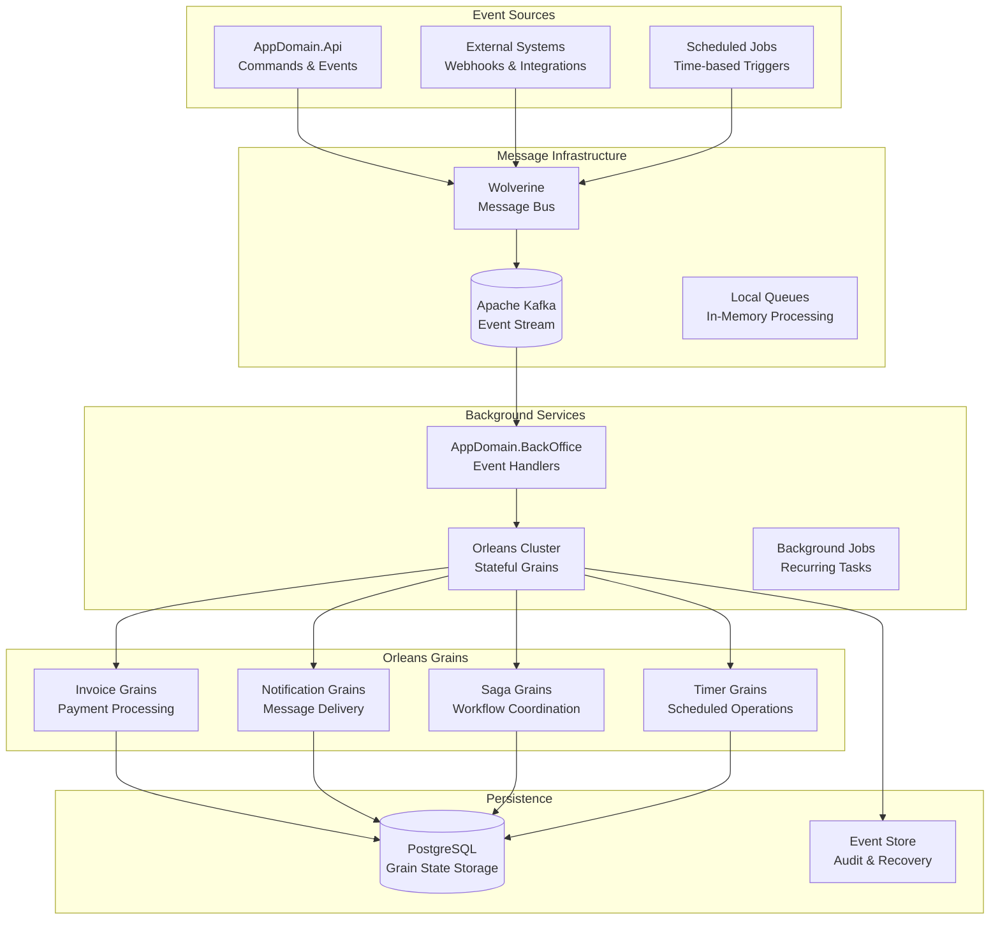

# Background Processing

The AppDomain Solution implements sophisticated background processing using Orleans for stateful operations and Wolverine for asynchronous message handling. This architecture enables long-running workflows, scheduled tasks, and complex business process orchestration.

## Architecture Overview



## Orleans Configuration

### Silo Setup

**Orleans Host Configuration**:

```csharp
// Program.cs in AppDomain.BackOffice.Orleans
var builder = Host.CreateApplicationBuilder(args);

builder.AddServiceDefaults();

// Configure Orleans
builder.UseOrleans((context, siloBuilder) =>
{
    if (context.HostingEnvironment.IsDevelopment())
    {
        siloBuilder
            .UseLocalhostClustering()
            .UseDashboard(options => { });
    }
    else
    {
        siloBuilder
            .UseKubernetesHosting()
            .UseAdoNetClustering(options =>
            {
                options.ConnectionString = context.Configuration.GetConnectionString("Orleans");
                options.Invariant = "Npgsql";
            });
    }

    // Configure grain persistence
    siloBuilder.AddAdoNetGrainStorageAsDefault(options =>
    {
        options.ConnectionString = context.Configuration.GetConnectionString("DefaultConnection");
        options.Invariant = "Npgsql";
    });

    // Configure reminders for scheduled operations
    siloBuilder.UseAdoNetReminderService(options =>
    {
        options.ConnectionString = context.Configuration.GetConnectionString("DefaultConnection");
        options.Invariant = "Npgsql";
    });

    // Configure streaming for real-time updates
    siloBuilder.AddMemoryStreams("StreamProvider");

    // Add application grains
    siloBuilder.ConfigureApplicationParts(parts =>
    {
        parts.AddApplicationPart(typeof(InvoiceGrain).Assembly)
             .WithReferences();
    });
});

// Configure Wolverine integration
builder.Services.AddWolverine(opts =>
{
    opts.UseKafka(builder.Configuration.GetConnectionString("Kafka"))
        .ConfigureConsumers(consumer =>
        {
            consumer.ConsumerConfig.GroupId = "appdomain-orleans";
            consumer.ConsumerConfig.AutoOffsetReset = AutoOffsetReset.Earliest;
        });

    // Route integration events to Orleans grains
    opts.PublishAllMessages()
        .ToKafkaTopic("appdomain-events")
        .SendSerializedJsonMessage();
});

var host = builder.Build();
await host.RunAsync();
```

### Grain State Management

**Invoice Processing Grain**:

```csharp
[GenerateSerializer]
public class InvoiceState
{
    [Id(0)] public Ulid InvoiceId { get; set; }
    [Id(1)] public string InvoiceNumber { get; set; } = string.Empty;
    [Id(2)] public decimal Amount { get; set; }
    [Id(3)] public string Currency { get; set; } = "USD";
    [Id(4)] public InvoiceStatus Status { get; set; } = InvoiceStatus.Created;
    [Id(5)] public DateOnly DueDate { get; set; }
    [Id(6)] public List<PaymentAttempt> PaymentAttempts { get; set; } = new();
    [Id(7)] public DateTimeOffset CreatedAt { get; set; }
    [Id(8)] public DateTimeOffset? PaidAt { get; set; }
    [Id(9)] public int RemindersSent { get; set; }
    [Id(10)] public DateTimeOffset LastUpdated { get; set; }
}

[GenerateSerializer]
public class PaymentAttempt
{
    [Id(0)] public Ulid PaymentId { get; set; }
    [Id(1)] public decimal Amount { get; set; }
    [Id(2)] public string PaymentMethod { get; set; } = string.Empty;
    [Id(3)] public PaymentStatus Status { get; set; }
    [Id(4)] public DateTimeOffset AttemptedAt { get; set; }
    [Id(5)] public string? FailureReason { get; set; }
}

public interface IInvoiceGrain : IGrainWithGuidKey
{
    Task HandleCreated(InvoiceCreated @event);
    Task HandlePaymentReceived(PaymentReceived @event);
    Task ProcessPaymentReminder();
    Task<InvoiceState> GetState();
    Task CancelInvoice(string reason);
}

[StatePersistence(StatePersistenceMode.Persisted)]
public class InvoiceGrain : Grain<InvoiceState>, IInvoiceGrain, IRemindable
{
    private readonly ILogger<InvoiceGrain> _logger;
    private readonly IPaymentService _paymentService;
    private readonly IMessagePublisher _publisher;
    private IGrainReminder? _paymentReminder;
    private IGrainReminder? _overdueReminder;

    public InvoiceGrain(
        ILogger<InvoiceGrain> logger,
        IPaymentService paymentService,
        IMessagePublisher publisher)
    {
        _logger = logger;
        _paymentService = paymentService;
        _publisher = publisher;
    }

    public async Task HandleCreated(InvoiceCreated @event)
    {
        _logger.LogInformation("Processing InvoiceCreated for {InvoiceId}", @event.InvoiceId);

        State.InvoiceId = @event.InvoiceId;
        State.InvoiceNumber = @event.InvoiceNumber;
        State.Amount = @event.Amount;
        State.Currency = @event.Currency;
        State.Status = InvoiceStatus.Created;
        State.DueDate = @event.DueDate;
        State.CreatedAt = @event.CreatedAt;
        State.LastUpdated = DateTimeOffset.UtcNow;

        await WriteStateAsync();

        // Schedule payment reminder 24 hours before due date
        var reminderTime = State.DueDate.ToDateTime(TimeOnly.MinValue).AddDays(-1);
        if (reminderTime > DateTime.UtcNow)
        {
            _paymentReminder = await RegisterOrUpdateReminder(
                "PaymentReminder",
                reminderTime.Subtract(DateTime.UtcNow),
                TimeSpan.FromDays(1)); // Repeat daily until paid
        }

        // Schedule overdue reminder for day after due date
        var overdueTime = State.DueDate.ToDateTime(TimeOnly.MinValue).AddDays(1);
        _overdueReminder = await RegisterOrUpdateReminder(
            "OverdueReminder",
            overdueTime.Subtract(DateTime.UtcNow),
            TimeSpan.FromDays(3)); // Repeat every 3 days

        _logger.LogInformation("Invoice {InvoiceId} processing setup completed", @event.InvoiceId);
    }

    public async Task HandlePaymentReceived(PaymentReceived @event)
    {
        _logger.LogInformation("Processing PaymentReceived for {InvoiceId}: {Amount}", 
            State.InvoiceId, @event.Amount);

        var paymentAttempt = new PaymentAttempt
        {
            PaymentId = @event.PaymentId,
            Amount = @event.Amount,
            PaymentMethod = @event.PaymentMethod,
            Status = PaymentStatus.Processing,
            AttemptedAt = @event.ReceivedAt
        };

        State.PaymentAttempts.Add(paymentAttempt);

        try
        {
            // Validate payment amount
            if (@event.Amount != State.Amount)
            {
                paymentAttempt.Status = PaymentStatus.Failed;
                paymentAttempt.FailureReason = $"Payment amount {$event.Amount} does not match invoice amount {State.Amount}";
                
                await WriteStateAsync();
                
                await _publisher.PublishAsync(new PaymentRejected(
                    State.InvoiceId,
                    @event.PaymentId,
                    paymentAttempt.FailureReason,
                    DateTimeOffset.UtcNow
                ));
                
                return;
            }

            // Process payment through external service
            var processResult = await _paymentService.ProcessPaymentAsync(
                @event.PaymentId,
                @event.Amount,
                @event.PaymentMethod
            );

            if (processResult.IsSuccess)
            {
                paymentAttempt.Status = PaymentStatus.Completed;
                State.Status = InvoiceStatus.Paid;
                State.PaidAt = DateTimeOffset.UtcNow;
                State.LastUpdated = DateTimeOffset.UtcNow;

                // Cancel reminders
                if (_paymentReminder != null)
                    await UnregisterReminder(_paymentReminder);
                if (_overdueReminder != null)
                    await UnregisterReminder(_overdueReminder);

                await WriteStateAsync();

                // Publish success event
                await _publisher.PublishAsync(new InvoicePaid(
                    State.InvoiceId,
                    @event.Amount,
                    State.PaidAt.Value,
                    @event.PaymentMethod
                ));

                _logger.LogInformation("Invoice {InvoiceId} successfully paid", State.InvoiceId);
            }
            else
            {
                paymentAttempt.Status = PaymentStatus.Failed;
                paymentAttempt.FailureReason = processResult.ErrorMessage;
                
                await WriteStateAsync();

                await _publisher.PublishAsync(new PaymentFailed(
                    State.InvoiceId,
                    @event.PaymentId,
                    processResult.ErrorMessage,
                    DateTimeOffset.UtcNow
                ));
            }
        }
        catch (Exception ex)
        {
            _logger.LogError(ex, "Error processing payment for invoice {InvoiceId}", State.InvoiceId);
            
            paymentAttempt.Status = PaymentStatus.Failed;
            paymentAttempt.FailureReason = "Payment processing error";
            
            await WriteStateAsync();
            throw;
        }
    }

    public async Task ProcessPaymentReminder()
    {
        if (State.Status == InvoiceStatus.Paid)
        {
            _logger.LogDebug("Skipping reminder for paid invoice {InvoiceId}", State.InvoiceId);
            return;
        }

        State.RemindersSent++;
        State.LastUpdated = DateTimeOffset.UtcNow;
        await WriteStateAsync();

        await _publisher.PublishAsync(new PaymentReminderRequired(
            State.InvoiceId,
            State.InvoiceNumber,
            State.Amount,
            State.Currency,
            State.DueDate,
            State.RemindersSent
        ));

        _logger.LogInformation("Payment reminder {Count} sent for invoice {InvoiceId}", 
            State.RemindersSent, State.InvoiceId);
    }

    public async Task CancelInvoice(string reason)
    {
        if (State.Status == InvoiceStatus.Paid)
            throw new InvalidOperationException("Cannot cancel a paid invoice");

        State.Status = InvoiceStatus.Cancelled;
        State.LastUpdated = DateTimeOffset.UtcNow;

        // Cancel all reminders
        if (_paymentReminder != null)
            await UnregisterReminder(_paymentReminder);
        if (_overdueReminder != null)
            await UnregisterReminder(_overdueReminder);

        await WriteStateAsync();

        await _publisher.PublishAsync(new InvoiceCancelled(
            State.InvoiceId,
            reason,
            DateTimeOffset.UtcNow
        ));

        _logger.LogInformation("Invoice {InvoiceId} cancelled: {Reason}", State.InvoiceId, reason);
    }

    public Task<InvoiceState> GetState() => Task.FromResult(State);

    // Handle reminder callbacks
    public async Task ReceiveReminder(string reminderName, TickStatus status)
    {
        _logger.LogDebug("Received reminder {ReminderName} for invoice {InvoiceId}", 
            reminderName, State.InvoiceId);

        switch (reminderName)
        {
            case "PaymentReminder":
                await ProcessPaymentReminder();
                break;

            case "OverdueReminder":
                if (State.Status != InvoiceStatus.Paid)
                {
                    await _publisher.PublishAsync(new InvoiceOverdue(
                        State.InvoiceId,
                        State.InvoiceNumber,
                        State.Amount,
                        State.DueDate,
                        DateTimeOffset.UtcNow
                    ));
                }
                break;

            default:
                _logger.LogWarning("Unknown reminder {ReminderName} for invoice {InvoiceId}", 
                    reminderName, State.InvoiceId);
                break;
        }
    }
}
```

## Saga Pattern Implementation

### Long-Running Business Processes

**Payment Processing Saga**:

```csharp
[GenerateSerializer]
public class PaymentSagaState
{
    [Id(0)] public Ulid SagaId { get; set; }
    [Id(1)] public Ulid InvoiceId { get; set; }
    [Id(2)] public Ulid PaymentId { get; set; }
    [Id(3)] public decimal Amount { get; set; }
    [Id(4)] public string PaymentMethod { get; set; } = string.Empty;
    [Id(5)] public SagaStatus Status { get; set; } = SagaStatus.Started;
    [Id(6)] public List<SagaStep> CompletedSteps { get; set; } = new();
    [Id(7)] public DateTimeOffset StartedAt { get; set; }
    [Id(8)] public DateTimeOffset? CompletedAt { get; set; }
    [Id(9)] public string? FailureReason { get; set; }
}

[GenerateSerializer]
public class SagaStep
{
    [Id(0)] public string StepName { get; set; } = string.Empty;
    [Id(1)] public SagaStepStatus Status { get; set; }
    [Id(2)] public DateTimeOffset ExecutedAt { get; set; }
    [Id(3)] public string? ErrorMessage { get; set; }
    [Id(4)] public string? CompensationData { get; set; }
}

public interface IPaymentProcessingSaga : IGrainWithGuidKey
{
    Task StartSaga(PaymentReceived @event);
    Task HandleValidationCompleted(PaymentValidated @event);
    Task HandlePaymentProcessed(PaymentProcessed @event);
    Task HandlePaymentFailed(PaymentFailed @event);
    Task CompensateFailedPayment();
}

[StatePersistence(StatePersistenceMode.Persisted)]
public class PaymentProcessingSaga : Grain<PaymentSagaState>, IPaymentProcessingSaga
{
    private readonly ILogger<PaymentProcessingSaga> _logger;
    private readonly IMessagePublisher _publisher;
    private readonly IPaymentService _paymentService;

    public PaymentProcessingSaga(
        ILogger<PaymentProcessingSaga> logger,
        IMessagePublisher publisher,
        IPaymentService paymentService)
    {
        _logger = logger;
        _publisher = publisher;
        _paymentService = paymentService;
    }

    public async Task StartSaga(PaymentReceived @event)
    {
        _logger.LogInformation("Starting payment processing saga for payment {PaymentId}", @event.PaymentId);

        State.SagaId = this.GetPrimaryKey();
        State.InvoiceId = @event.InvoiceId;
        State.PaymentId = @event.PaymentId;
        State.Amount = @event.Amount;
        State.PaymentMethod = @event.PaymentMethod;
        State.Status = SagaStatus.InProgress;
        State.StartedAt = DateTimeOffset.UtcNow;

        await WriteStateAsync();

        // Step 1: Validate payment
        await ExecuteStep("ValidatePayment", async () =>
        {
            await _publisher.PublishAsync(new ValidatePaymentCommand(
                @event.PaymentId,
                @event.InvoiceId,
                @event.Amount,
                @event.PaymentMethod
            ));
        });
    }

    public async Task HandleValidationCompleted(PaymentValidated @event)
    {
        if (@event.PaymentId != State.PaymentId)
            return; // Not for this saga

        _logger.LogInformation("Payment validation completed for {PaymentId}: {IsValid}", 
            @event.PaymentId, @event.IsValid);

        if (@event.IsValid)
        {
            await CompleteStep("ValidatePayment", SagaStepStatus.Completed);

            // Step 2: Process payment
            await ExecuteStep("ProcessPayment", async () =>
            {
                await _publisher.PublishAsync(new ProcessPaymentCommand(
                    State.PaymentId,
                    State.InvoiceId,
                    State.Amount,
                    State.PaymentMethod
                ));
            });
        }
        else
        {
            await CompleteStep("ValidatePayment", SagaStepStatus.Failed, @event.ValidationErrors);
            await FailSaga($"Payment validation failed: {@event.ValidationErrors}");
        }
    }

    public async Task HandlePaymentProcessed(PaymentProcessed @event)
    {
        if (@event.PaymentId != State.PaymentId)
            return; // Not for this saga

        _logger.LogInformation("Payment processed successfully for {PaymentId}", @event.PaymentId);

        await CompleteStep("ProcessPayment", SagaStepStatus.Completed);

        // Step 3: Update invoice status
        await ExecuteStep("UpdateInvoice", async () =>
        {
            var invoiceGrain = GrainFactory.GetGrain<IInvoiceGrain>(State.InvoiceId.ToGuid());
            await invoiceGrain.HandlePaymentReceived(new PaymentReceived(
                State.InvoiceId,
                State.PaymentId,
                State.Amount,
                State.PaymentMethod,
                DateTimeOffset.UtcNow
            ));
        });

        await CompleteStep("UpdateInvoice", SagaStepStatus.Completed);
        await CompleteSaga();
    }

    public async Task HandlePaymentFailed(PaymentFailed @event)
    {
        if (@event.PaymentId != State.PaymentId)
            return; // Not for this saga

        _logger.LogWarning("Payment processing failed for {PaymentId}: {Reason}", 
            @event.PaymentId, @event.Reason);

        await CompleteStep("ProcessPayment", SagaStepStatus.Failed, @event.Reason);
        await FailSaga($"Payment processing failed: {@event.Reason}");
    }

    public async Task CompensateFailedPayment()
    {
        _logger.LogInformation("Starting compensation for failed payment saga {SagaId}", State.SagaId);

        State.Status = SagaStatus.Compensating;
        await WriteStateAsync();

        // Compensate completed steps in reverse order
        var completedSteps = State.CompletedSteps
            .Where(s => s.Status == SagaStepStatus.Completed)
            .OrderByDescending(s => s.ExecutedAt)
            .ToList();

        foreach (var step in completedSteps)
        {
            try
            {
                await CompensateStep(step.StepName);
                step.Status = SagaStepStatus.Compensated;
            }
            catch (Exception ex)
            {
                _logger.LogError(ex, "Failed to compensate step {StepName} in saga {SagaId}", 
                    step.StepName, State.SagaId);
                step.Status = SagaStepStatus.CompensationFailed;
                step.ErrorMessage = ex.Message;
            }
        }

        State.Status = SagaStatus.Compensated;
        State.CompletedAt = DateTimeOffset.UtcNow;
        await WriteStateAsync();
    }

    private async Task ExecuteStep(string stepName, Func<Task> stepAction)
    {
        var step = new SagaStep
        {
            StepName = stepName,
            Status = SagaStepStatus.InProgress,
            ExecutedAt = DateTimeOffset.UtcNow
        };

        State.CompletedSteps.Add(step);
        await WriteStateAsync();

        try
        {
            await stepAction();
        }
        catch (Exception ex)
        {
            _logger.LogError(ex, "Step {StepName} failed in saga {SagaId}", stepName, State.SagaId);
            step.Status = SagaStepStatus.Failed;
            step.ErrorMessage = ex.Message;
            await WriteStateAsync();
            throw;
        }
    }

    private async Task CompleteStep(string stepName, SagaStepStatus status, string? errorMessage = null)
    {
        var step = State.CompletedSteps.FirstOrDefault(s => s.StepName == stepName);
        if (step != null)
        {
            step.Status = status;
            step.ErrorMessage = errorMessage;
            await WriteStateAsync();
        }
    }

    private async Task CompleteSaga()
    {
        State.Status = SagaStatus.Completed;
        State.CompletedAt = DateTimeOffset.UtcNow;
        await WriteStateAsync();

        await _publisher.PublishAsync(new PaymentSagaCompleted(
            State.SagaId,
            State.InvoiceId,
            State.PaymentId,
            State.Amount,
            DateTimeOffset.UtcNow
        ));

        _logger.LogInformation("Payment processing saga {SagaId} completed successfully", State.SagaId);
    }

    private async Task FailSaga(string reason)
    {
        State.Status = SagaStatus.Failed;
        State.FailureReason = reason;
        State.CompletedAt = DateTimeOffset.UtcNow;
        await WriteStateAsync();

        // Start compensation process
        await CompensateFailedPayment();

        await _publisher.PublishAsync(new PaymentSagaFailed(
            State.SagaId,
            State.InvoiceId,
            State.PaymentId,
            reason,
            DateTimeOffset.UtcNow
        ));
    }

    private async Task CompensateStep(string stepName)
    {
        switch (stepName)
        {
            case "ValidatePayment":
                // No compensation needed for validation
                break;

            case "ProcessPayment":
                // Refund the processed payment
                await _paymentService.RefundPaymentAsync(State.PaymentId, State.Amount);
                break;

            case "UpdateInvoice":
                // Revert invoice status
                var invoiceGrain = GrainFactory.GetGrain<IInvoiceGrain>(State.InvoiceId.ToGuid());
                await invoiceGrain.CancelInvoice("Payment saga compensation");
                break;

            default:
                _logger.LogWarning("No compensation logic defined for step {StepName}", stepName);
                break;
        }
    }
}
```

## Background Job Processing

### Wolverine Background Processing

**Event Handler for Background Processing**:

```csharp
public class AppDomainInboxHandler
{
    private readonly ILogger<AppDomainInboxHandler> _logger;
    private readonly IGrainFactory _grainFactory;
    private readonly IMessagePublisher _publisher;

    public AppDomainInboxHandler(
        ILogger<AppDomainInboxHandler> logger,
        IGrainFactory grainFactory,
        IMessagePublisher publisher)
    {
        _logger = logger;
        _grainFactory = grainFactory;
        _publisher = publisher;
    }

    // Handle cashier creation events
    public async Task Handle(CashierCreated @event)
    {
        _logger.LogInformation("Processing CashierCreated event for {CashierId}", @event.CashierId);

        try
        {
            // Update read model in background
            await UpdateCashierReadModel(@event);

            // Send welcome notification
            var notificationGrain = _grainFactory.GetGrain<INotificationGrain>(@event.CashierId.ToGuid());
            await notificationGrain.SendWelcomeNotification(@event.Name, @event.Email);

            // Create cashier performance tracking
            var performanceGrain = _grainFactory.GetGrain<IPerformanceTrackingGrain>(@event.CashierId.ToGuid());
            await performanceGrain.InitializeTracking(@event.CashierId, @event.CreatedAt);

            _logger.LogInformation("Successfully processed CashierCreated event for {CashierId}", @event.CashierId);
        }
        catch (Exception ex)
        {
            _logger.LogError(ex, "Failed to process CashierCreated event for {CashierId}", @event.CashierId);
            throw; // Re-throw to trigger retry logic
        }
    }

    // Handle invoice creation with Orleans integration
    public async Task Handle(InvoiceCreated @event)
    {
        _logger.LogInformation("Processing InvoiceCreated event for {InvoiceId}", @event.InvoiceId);

        try
        {
            // Initialize invoice processing grain
            var invoiceGrain = _grainFactory.GetGrain<IInvoiceGrain>(@event.InvoiceId.ToGuid());
            await invoiceGrain.HandleCreated(@event);

            // Update analytics
            await UpdateInvoiceAnalytics(@event);

            _logger.LogInformation("Successfully processed InvoiceCreated event for {InvoiceId}", @event.InvoiceId);
        }
        catch (Exception ex)
        {
            _logger.LogError(ex, "Failed to process InvoiceCreated event for {InvoiceId}", @event.InvoiceId);
            throw;
        }
    }

    // Handle payment received events
    [WolverineHandler]
    public async Task Handle(PaymentReceived @event)
    {
        _logger.LogInformation("Processing PaymentReceived event for invoice {InvoiceId}", @event.InvoiceId);

        try
        {
            // Start payment processing saga
            var sagaId = Guid.NewGuid();
            var paymentSaga = _grainFactory.GetGrain<IPaymentProcessingSaga>(sagaId);
            await paymentSaga.StartSaga(@event);

            _logger.LogInformation("Started payment processing saga {SagaId} for payment {PaymentId}", 
                sagaId, @event.PaymentId);
        }
        catch (Exception ex)
        {
            _logger.LogError(ex, "Failed to start payment processing saga for payment {PaymentId}", @event.PaymentId);
            throw;
        }
    }

    // Handle business day ended event for batch processing
    [WolverineHandler]
    public async Task Handle(BusinessDayEnded @event)
    {
        _logger.LogInformation("Processing BusinessDayEnded event for {Date}", @event.Date);

        try
        {
            // Generate daily reports
            await GenerateDailyReports(@event.Date);

            // Process pending reconciliations
            await ProcessPendingReconciliations(@event.Date);

            // Send summary notifications
            await SendDailySummaryNotifications(@event.Date);

            _logger.LogInformation("Successfully processed BusinessDayEnded event for {Date}", @event.Date);
        }
        catch (Exception ex)
        {
            _logger.LogError(ex, "Failed to process BusinessDayEnded event for {Date}", @event.Date);
            throw;
        }
    }

    private async Task UpdateCashierReadModel(CashierCreated @event)
    {
        // Update read model for query performance
        // This could be a separate database or cache update
    }

    private async Task UpdateInvoiceAnalytics(InvoiceCreated @event)
    {
        // Update analytics data
        // Track invoice metrics, trends, etc.
    }

    private async Task GenerateDailyReports(DateOnly date)
    {
        // Generate and store daily reports
        await _publisher.PublishAsync(new GenerateDailyReportCommand(date, "InvoiceSummary"));
        await _publisher.PublishAsync(new GenerateDailyReportCommand(date, "PaymentSummary"));
        await _publisher.PublishAsync(new GenerateDailyReportCommand(date, "CashierPerformance"));
    }

    private async Task ProcessPendingReconciliations(DateOnly date)
    {
        // Process reconciliations for the business day
        await _publisher.PublishAsync(new ProcessReconciliationCommand(date));
    }

    private async Task SendDailySummaryNotifications(DateOnly date)
    {
        // Send daily summary to management
        await _publisher.PublishAsync(new SendDailySummaryCommand(date));
    }
}
```

### Scheduled Background Jobs

**Recurring Job Implementation**:

```csharp
public interface IScheduledJobGrain : IGrainWithStringKey
{
    Task ScheduleRecurringJob(string jobName, TimeSpan interval, string jobData);
    Task ExecuteJob();
    Task CancelJob();
}

[StatePersistence(StatePersistenceMode.Persisted)]
public class ScheduledJobGrain : Grain<ScheduledJobState>, IScheduledJobGrain, IRemindable
{
    private readonly ILogger<ScheduledJobGrain> _logger;
    private readonly IMessagePublisher _publisher;
    private readonly IServiceProvider _serviceProvider;

    public ScheduledJobGrain(
        ILogger<ScheduledJobGrain> logger,
        IMessagePublisher publisher,
        IServiceProvider serviceProvider)
    {
        _logger = logger;
        _publisher = publisher;
        _serviceProvider = serviceProvider;
    }

    public async Task ScheduleRecurringJob(string jobName, TimeSpan interval, string jobData)
    {
        State.JobName = jobName;
        State.Interval = interval;
        State.JobData = jobData;
        State.IsActive = true;
        State.CreatedAt = DateTimeOffset.UtcNow;

        await WriteStateAsync();

        // Register Orleans reminder for recurring execution
        await RegisterOrUpdateReminder("JobExecution", interval, interval);

        _logger.LogInformation("Scheduled recurring job {JobName} with interval {Interval}", 
            jobName, interval);
    }

    public async Task ExecuteJob()
    {
        if (!State.IsActive)
        {
            _logger.LogDebug("Skipping execution of inactive job {JobName}", State.JobName);
            return;
        }

        _logger.LogInformation("Executing scheduled job {JobName}", State.JobName);

        State.LastExecuted = DateTimeOffset.UtcNow;
        State.ExecutionCount++;

        try
        {
            // Execute the specific job based on job name
            switch (State.JobName)
            {
                case "DailyInvoiceReport":
                    await ExecuteDailyInvoiceReport();
                    break;

                case "PaymentReminderBatch":
                    await ExecutePaymentReminderBatch();
                    break;

                case "DataCleanup":
                    await ExecuteDataCleanup();
                    break;

                case "HealthCheck":
                    await ExecuteHealthCheck();
                    break;

                default:
                    _logger.LogWarning("Unknown job type: {JobName}", State.JobName);
                    break;
            }

            State.LastSuccessfulExecution = DateTimeOffset.UtcNow;
            _logger.LogInformation("Successfully executed job {JobName}", State.JobName);
        }
        catch (Exception ex)
        {
            State.FailureCount++;
            State.LastError = ex.Message;
            
            _logger.LogError(ex, "Failed to execute job {JobName}", State.JobName);
            
            // Publish failure event for monitoring
            await _publisher.PublishAsync(new ScheduledJobFailed(
                State.JobName,
                ex.Message,
                DateTimeOffset.UtcNow
            ));

            // Disable job after too many failures
            if (State.FailureCount >= 5)
            {
                State.IsActive = false;
                await UnregisterReminder("JobExecution");
                
                _logger.LogError("Disabled job {JobName} after {FailureCount} consecutive failures", 
                    State.JobName, State.FailureCount);
            }
        }
        finally
        {
            await WriteStateAsync();
        }
    }

    public async Task CancelJob()
    {
        State.IsActive = false;
        await WriteStateAsync();
        
        await UnregisterReminder("JobExecution");
        
        _logger.LogInformation("Cancelled scheduled job {JobName}", State.JobName);
    }

    public async Task ReceiveReminder(string reminderName, TickStatus status)
    {
        if (reminderName == "JobExecution")
        {
            await ExecuteJob();
        }
    }

    private async Task ExecuteDailyInvoiceReport()
    {
        var yesterday = DateOnly.FromDateTime(DateTime.UtcNow.AddDays(-1));
        await _publisher.PublishAsync(new GenerateDailyReportCommand(yesterday, "InvoiceReport"));
    }

    private async Task ExecutePaymentReminderBatch()
    {
        // Find all invoices due for reminders
        var today = DateOnly.FromDateTime(DateTime.UtcNow);
        await _publisher.PublishAsync(new ProcessPaymentRemindersCommand(today));
    }

    private async Task ExecuteDataCleanup()
    {
        // Clean up old data
        var cutoffDate = DateTimeOffset.UtcNow.AddDays(-90);
        await _publisher.PublishAsync(new CleanupOldDataCommand(cutoffDate));
    }

    private async Task ExecuteHealthCheck()
    {
        // Perform system health checks
        await _publisher.PublishAsync(new SystemHealthCheckCommand());
    }
}

[GenerateSerializer]
public class ScheduledJobState
{
    [Id(0)] public string JobName { get; set; } = string.Empty;
    [Id(1)] public TimeSpan Interval { get; set; }
    [Id(2)] public string JobData { get; set; } = string.Empty;
    [Id(3)] public bool IsActive { get; set; }
    [Id(4)] public DateTimeOffset CreatedAt { get; set; }
    [Id(5)] public DateTimeOffset? LastExecuted { get; set; }
    [Id(6)] public DateTimeOffset? LastSuccessfulExecution { get; set; }
    [Id(7)] public int ExecutionCount { get; set; }
    [Id(8)] public int FailureCount { get; set; }
    [Id(9)] public string? LastError { get; set; }
}
```

## Streaming and Real-Time Processing

### Orleans Streams

**Real-Time Notification Streaming**:

```csharp
public interface INotificationGrain : IGrainWithGuidKey
{
    Task SendWelcomeNotification(string name, string email);
    Task SendPaymentReminder(Ulid invoiceId, decimal amount);
    Task SubscribeToNotifications(string clientId);
    Task UnsubscribeFromNotifications(string clientId);
}

[StatePersistence(StatePersistenceMode.Persisted)]
public class NotificationGrain : Grain<NotificationState>, INotificationGrain
{
    private readonly ILogger<NotificationGrain> _logger;
    private readonly INotificationService _notificationService;
    private IAsyncStream<NotificationMessage>? _stream;

    public NotificationGrain(
        ILogger<NotificationGrain> logger,
        INotificationService notificationService)
    {
        _logger = logger;
        _notificationService = notificationService;
    }

    public override async Task OnActivateAsync(CancellationToken cancellationToken)
    {
        // Initialize stream for real-time notifications
        var streamProvider = this.GetStreamProvider("StreamProvider");
        _stream = streamProvider.GetStream<NotificationMessage>("notifications", this.GetPrimaryKey());
        
        await base.OnActivateAsync(cancellationToken);
    }

    public async Task SendWelcomeNotification(string name, string email)
    {
        _logger.LogInformation("Sending welcome notification to {Name} ({Email})", name, email);

        var notification = new NotificationMessage
        {
            Type = NotificationType.Welcome,
            Recipient = email,
            Subject = $"Welcome to AppDomain, {name}!",
            Message = $"Hello {name}, welcome to the AppDomain solution. Your account has been successfully created.",
            CreatedAt = DateTimeOffset.UtcNow
        };

        // Send via external service
        await _notificationService.SendEmailAsync(notification);

        // Stream for real-time updates
        if (_stream != null)
        {
            await _stream.OnNextAsync(notification);
        }

        // Track notification history
        State.NotificationHistory.Add(notification);
        await WriteStateAsync();
    }

    public async Task SendPaymentReminder(Ulid invoiceId, decimal amount)
    {
        _logger.LogInformation("Sending payment reminder for invoice {InvoiceId}", invoiceId);

        var notification = new NotificationMessage
        {
            Type = NotificationType.PaymentReminder,
            Recipient = State.Email,
            Subject = "Payment Reminder - Invoice Due",
            Message = $"This is a reminder that your invoice (ID: {invoiceId}) for ${amount:F2} is due for payment.",
            CreatedAt = DateTimeOffset.UtcNow,
            Metadata = new Dictionary<string, string>
            {
                ["InvoiceId"] = invoiceId.ToString(),
                ["Amount"] = amount.ToString("F2")
            }
        };

        await _notificationService.SendEmailAsync(notification);

        if (_stream != null)
        {
            await _stream.OnNextAsync(notification);
        }

        State.NotificationHistory.Add(notification);
        await WriteStateAsync();
    }

    public async Task SubscribeToNotifications(string clientId)
    {
        if (!State.Subscribers.Contains(clientId))
        {
            State.Subscribers.Add(clientId);
            await WriteStateAsync();
        }

        _logger.LogInformation("Client {ClientId} subscribed to notifications for grain {GrainId}", 
            clientId, this.GetPrimaryKey());
    }

    public async Task UnsubscribeFromNotifications(string clientId)
    {
        if (State.Subscribers.Remove(clientId))
        {
            await WriteStateAsync();
        }

        _logger.LogInformation("Client {ClientId} unsubscribed from notifications for grain {GrainId}", 
            clientId, this.GetPrimaryKey());
    }
}

[GenerateSerializer]
public class NotificationState
{
    [Id(0)] public string Email { get; set; } = string.Empty;
    [Id(1)] public List<NotificationMessage> NotificationHistory { get; set; } = new();
    [Id(2)] public List<string> Subscribers { get; set; } = new();
    [Id(3)] public NotificationPreferences Preferences { get; set; } = new();
}

[GenerateSerializer]
public class NotificationMessage
{
    [Id(0)] public NotificationType Type { get; set; }
    [Id(1)] public string Recipient { get; set; } = string.Empty;
    [Id(2)] public string Subject { get; set; } = string.Empty;
    [Id(3)] public string Message { get; set; } = string.Empty;
    [Id(4)] public DateTimeOffset CreatedAt { get; set; }
    [Id(5)] public Dictionary<string, string> Metadata { get; set; } = new();
}
```

## Monitoring and Observability

### Performance Monitoring

**Grain Performance Tracking**:

```csharp
public class GrainCallFilter : IIncomingGrainCallFilter
{
    private readonly IMetrics _metrics;
    private readonly ILogger<GrainCallFilter> _logger;

    public GrainCallFilter(IMetrics metrics, ILogger<GrainCallFilter> logger)
    {
        _metrics = metrics;
        _logger = logger;
    }

    public async Task Invoke(IIncomingGrainCallContext context)
    {
        var grainType = context.Grain.GetType().Name;
        var methodName = context.InterfaceMethod.Name;
        var stopwatch = Stopwatch.StartNew();

        using var activity = ActivitySource.StartActivity($"Grain.{grainType}.{methodName}");
        activity?.SetTag("grain.type", grainType);
        activity?.SetTag("grain.method", methodName);
        activity?.SetTag("grain.id", context.Grain.GetPrimaryKeyString());

        try
        {
            await context.Invoke();
            
            // Record success metrics
            _metrics.Counter("grain_calls_total")
                .WithTag("grain_type", grainType)
                .WithTag("method", methodName)
                .WithTag("status", "success")
                .Increment();

            activity?.SetStatus(ActivityStatusCode.Ok);
        }
        catch (Exception ex)
        {
            // Record error metrics
            _metrics.Counter("grain_calls_total")
                .WithTag("grain_type", grainType)
                .WithTag("method", methodName)
                .WithTag("status", "error")
                .WithTag("error_type", ex.GetType().Name)
                .Increment();

            activity?.SetStatus(ActivityStatusCode.Error, ex.Message);
            activity?.RecordException(ex);

            _logger.LogError(ex, "Error in grain {GrainType}.{Method}", grainType, methodName);
            throw;
        }
        finally
        {
            stopwatch.Stop();
            
            // Record duration metrics
            _metrics.Histogram("grain_call_duration_ms")
                .WithTag("grain_type", grainType)
                .WithTag("method", methodName)
                .Record(stopwatch.ElapsedMilliseconds);
        }
    }

    private static readonly ActivitySource ActivitySource = new("AppDomain.Orleans");
}
```

### Health Checks

**Orleans Health Monitoring**:

```csharp
public class OrleansHealthCheck : IHealthCheck
{
    private readonly IGrainFactory _grainFactory;
    private readonly ILogger<OrleansHealthCheck> _logger;

    public OrleansHealthCheck(IGrainFactory grainFactory, ILogger<OrleansHealthCheck> logger)
    {
        _grainFactory = grainFactory;
        _logger = logger;
    }

    public async Task<HealthCheckResult> CheckHealthAsync(HealthCheckContext context, CancellationToken cancellationToken = default)
    {
        try
        {
            // Test grain activation and method call
            var testGrain = _grainFactory.GetGrain<IHealthCheckGrain>(Guid.NewGuid());
            var response = await testGrain.Ping();
            
            if (response == "pong")
            {
                return HealthCheckResult.Healthy("Orleans cluster is responding");
            }
            
            return HealthCheckResult.Unhealthy("Orleans cluster is not responding correctly");
        }
        catch (Exception ex)
        {
            _logger.LogError(ex, "Orleans health check failed");
            return HealthCheckResult.Unhealthy($"Orleans cluster is unhealthy: {ex.Message}");
        }
    }
}

public interface IHealthCheckGrain : IGrainWithGuidKey
{
    Task<string> Ping();
}

public class HealthCheckGrain : Grain, IHealthCheckGrain
{
    public Task<string> Ping()
    {
        return Task.FromResult("pong");
    }
}
```

## Testing Background Processing

### Unit Testing Grains

**Testing Invoice Grain**:

```csharp
[TestFixture]
public class InvoiceGrainTests
{
    private TestCluster _cluster;
    private IGrainFactory _grainFactory;

    [OneTimeSetUp]
    public async Task OneTimeSetUp()
    {
        var builder = new TestClusterBuilder();
        
        builder.AddSiloBuilderConfigurator<TestSiloConfiguration>();
        builder.AddClientBuilderConfigurator<TestClientConfiguration>();
        
        _cluster = builder.Build();
        await _cluster.DeployAsync();
        
        _grainFactory = _cluster.Client;
    }

    [Test]
    public async Task Should_Handle_Invoice_Created_Event()
    {
        // Arrange
        var invoiceId = Ulid.NewUlid();
        var grain = _grainFactory.GetGrain<IInvoiceGrain>(invoiceId.ToGuid());
        
        var @event = new InvoiceCreated(
            invoiceId,
            "TEST-001",
            1000.00m,
            "USD",
            Ulid.NewUlid(),
            DateTimeOffset.UtcNow,
            DateOnly.FromDateTime(DateTime.Today.AddDays(30))
        );

        // Act
        await grain.HandleCreated(@event);
        var state = await grain.GetState();

        // Assert
        state.InvoiceId.Should().Be(invoiceId);
        state.InvoiceNumber.Should().Be("TEST-001");
        state.Amount.Should().Be(1000.00m);
        state.Status.Should().Be(InvoiceStatus.Created);
    }

    [Test]
    public async Task Should_Process_Payment_Successfully()
    {
        // Arrange
        var invoiceId = Ulid.NewUlid();
        var grain = _grainFactory.GetGrain<IInvoiceGrain>(invoiceId.ToGuid());
        
        // Create invoice first
        await grain.HandleCreated(new InvoiceCreated(
            invoiceId, "TEST-002", 500.00m, "USD", Ulid.NewUlid(),
            DateTimeOffset.UtcNow, DateOnly.FromDateTime(DateTime.Today.AddDays(30))
        ));

        var paymentEvent = new PaymentReceived(
            invoiceId,
            Ulid.NewUlid(),
            500.00m,
            "CreditCard",
            DateTimeOffset.UtcNow
        );

        // Act
        await grain.HandlePaymentReceived(paymentEvent);
        var state = await grain.GetState();

        // Assert
        state.Status.Should().Be(InvoiceStatus.Paid);
        state.PaidAt.Should().NotBeNull();
        state.PaymentAttempts.Should().HaveCount(1);
        state.PaymentAttempts.First().Status.Should().Be(PaymentStatus.Completed);
    }

    [OneTimeTearDown]
    public async Task OneTimeTearDown()
    {
        if (_cluster != null)
        {
            await _cluster.StopAllSilosAsync();
            await _cluster.DisposeAsync();
        }
    }
}

public class TestSiloConfiguration : ISiloConfigurator
{
    public void Configure(ISiloBuilder siloBuilder)
    {
        siloBuilder.UseInMemoryReminderService();
        siloBuilder.AddMemoryGrainStorageAsDefault();
        siloBuilder.AddMemoryStreams("StreamProvider");
        
        // Mock external services
        siloBuilder.ConfigureServices(services =>
        {
            services.AddSingleton<IPaymentService, MockPaymentService>();
            services.AddSingleton<INotificationService, MockNotificationService>();
        });
    }
}

public class TestClientConfiguration : IClientBuilderConfigurator
{
    public void Configure(IClientBuilder clientBuilder)
    {
        clientBuilder.AddMemoryStreams("StreamProvider");
    }
}
```

## Best Practices

### Grain Design Guidelines

1. **Single Responsibility**: Each grain should handle one business entity
2. **Immutable State**: Use immutable records for grain state
3. **Graceful Degradation**: Handle failures gracefully with retries and circuit breakers
4. **Resource Management**: Properly dispose of resources in grain lifecycle methods
5. **Serialization**: Use `[GenerateSerializer]` for performance

### Error Handling Strategies

```csharp
public class RobustGrain : Grain<RobustState>, IRobustGrain
{
    public async Task ProcessWithRetry<T>(Func<Task<T>> operation, int maxRetries = 3)
    {
        for (int attempt = 1; attempt <= maxRetries; attempt++)
        {
            try
            {
                await operation();
                return;
            }
            catch (Exception ex) when (attempt < maxRetries && IsRetryableException(ex))
            {
                var delay = TimeSpan.FromSeconds(Math.Pow(2, attempt)); // Exponential backoff
                await Task.Delay(delay);
                
                _logger.LogWarning("Attempt {Attempt} failed, retrying in {Delay}: {Error}", 
                    attempt, delay, ex.Message);
            }
        }
    }

    private static bool IsRetryableException(Exception ex)
    {
        return ex is SqlException or TimeoutException or HttpRequestException;
    }
}
```

### Performance Optimization

1. **Grain Placement**: Use placement strategies for optimal distribution
2. **State Management**: Load state lazily and cache frequently accessed data
3. **Batching**: Process multiple operations together when possible
4. **Streaming**: Use Orleans Streams for high-throughput scenarios
5. **Monitoring**: Track grain performance and identify bottlenecks

## Related Resources

- [Event-Driven Architecture](/arch/events) - Event sourcing and messaging patterns
- [Testing Strategies](/arch/testing) - Testing Orleans grains and background services
- [Database Design](/arch/database) - State persistence and event sourcing
- [Debugging Tips](/guide/debugging) - Troubleshooting Orleans and background processing
- [Orleans Documentation](https://docs.microsoft.com/en-us/dotnet/orleans/) - Official Orleans documentation
- [Wolverine Documentation](https://wolverine.netlify.app/) - Message bus and background processing