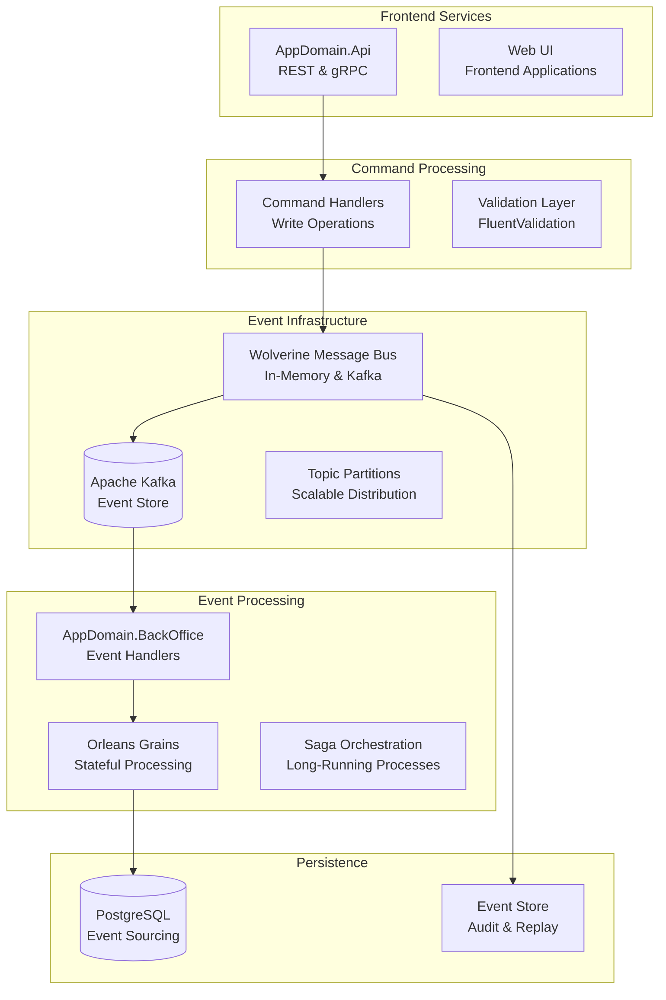

# Event-Driven Architecture

The AppDomain Solution implements a robust event-driven architecture (EDA) that enables loose coupling between services, scalable message processing, and real-time business event handling. This architecture supports both domain events for internal consistency and integration events for cross-service communication.

## Architecture Overview



## Event Types

### Domain Events

**Purpose**: Internal consistency within bounded contexts

**Characteristics**:
- Synchronous processing within the same transaction
- Maintain data consistency
- Trigger side effects within the same domain

**Example**:

```csharp
// Domain event for internal processing
public record InvoiceGenerated : IDomainEvent
{
    public required Ulid InvoiceId { get; init; }
    public required string InvoiceNumber { get; init; }
    public required decimal Amount { get; init; }
    public required DateTimeOffset GeneratedAt { get; init; } = DateTimeOffset.UtcNow;
}
```

**Usage in Command Handler**:

```csharp
[DbCommand(sp: "AppDomain.invoices_create")]
public partial class CreateInvoiceCommandHandler : IRequestHandler<CreateInvoiceCommand, Result<Invoice>>
{
    public async Task<Result<Invoice>> Handle(CreateInvoiceCommand request, CancellationToken cancellationToken)
    {
        // Execute stored procedure (generated)
        var invoice = await ExecuteDbCommand(request, cancellationToken);
        
        // Publish domain event for internal consistency
        await _mediator.Publish(new InvoiceGenerated
        {
            InvoiceId = invoice.InvoiceId,
            InvoiceNumber = invoice.InvoiceNumber,
            Amount = invoice.Amount
        }, cancellationToken);
        
        return Result.Success(invoice);
    }
}
```

### Integration Events

**Purpose**: Cross-service communication and business process coordination

**Characteristics**:
- Asynchronous processing across service boundaries
- Enable loose coupling between microservices
- Support eventual consistency patterns

**Event Schema Definition**:

```csharp
/// <summary>
/// Published when a new invoice is created in the system.
/// Used by accounting and notification services for downstream processing.
/// </summary>
/// <param name="InvoiceId">Unique identifier for the created invoice</param>
/// <param name="InvoiceNumber">Human-readable invoice number</param>
/// <param name="Amount">Invoice total amount in base currency units</param>
/// <param name="Currency">ISO 4217 currency code (e.g., "USD", "EUR")</param>
/// <param name="CashierId">Identifier of the cashier who created the invoice</param>
/// <param name="CreatedAt">Timestamp when the invoice was created (UTC)</param>
/// <param name="DueDate">Payment due date for the invoice</param>
public record InvoiceCreated(
    Ulid InvoiceId,
    string InvoiceNumber,
    decimal Amount,
    string Currency,
    Ulid CashierId,
    DateTimeOffset CreatedAt,
    DateOnly DueDate
) : IIntegrationEvent;
```

[!TIP]
XML documentation comments on integration events are used to auto-generate event schema documentation.

## Event Publishing

### Wolverine Message Bus Configuration

**Service Registration**:

```csharp
// Program.cs or Startup.cs
services.AddWolverine(opts =>
{
    // Configure local processing
    opts.LocalQueue("invoices")
        .Sequential()
        .UseDurableInbox();

    // Configure Kafka integration
    opts.UseKafka("localhost:9092")
        .ConfigureProducers(producer =>
        {
            producer.ProducerConfig.EnableIdempotence = true;
            producer.ProducerConfig.MaxInFlight = 1;
            producer.ProducerConfig.Acks = Acks.All;
        });

    // Publishing configuration
    opts.PublishAllMessages()
        .ToKafkaTopic("appdomain-events")
        .SendSerializedJsonMessage()
        .UseHeaderRouting();
});
```

### Event Publishing Patterns

**Direct Publishing**:

```csharp
public class InvoiceService
{
    private readonly IMessagePublisher _publisher;

    public async Task<Result> ProcessInvoicePayment(Ulid invoiceId, decimal amount)
    {
        // Business logic
        var payment = await ProcessPayment(invoiceId, amount);
        
        // Publish integration event
        await _publisher.PublishAsync(new InvoicePaid(
            InvoiceId: invoiceId,
            Amount: amount,
            PaidAt: DateTimeOffset.UtcNow,
            PaymentMethod: payment.Method
        ));

        return Result.Success();
    }
}
```

**Command Handler Publishing**:

```csharp
public partial class MarkInvoiceAsPaidCommandHandler 
{
    protected override async Task PublishIntegrationEvents(Invoice invoice)
    {
        // Auto-generated method called after successful command execution
        await _publisher.PublishAsync(new InvoicePaid(
            InvoiceId: invoice.InvoiceId,
            Amount: invoice.Amount,
            PaidAt: DateTimeOffset.UtcNow,
            PaymentReference: invoice.PaymentReference
        ));
    }
}
```

## Event Consumption

### Event Handlers

**Simple Event Handler**:

```csharp
public class InvoicePaidHandler
{
    private readonly ILogger<InvoicePaidHandler> _logger;
    private readonly INotificationService _notificationService;

    public InvoicePaidHandler(
        ILogger<InvoicePaidHandler> logger,
        INotificationService notificationService)
    {
        _logger = logger;
        _notificationService = notificationService;
    }

    public async Task Handle(InvoicePaid @event)
    {
        _logger.LogInformation("Processing InvoicePaid event for invoice {InvoiceId}", @event.InvoiceId);

        try
        {
            // Send payment confirmation notification
            await _notificationService.SendPaymentConfirmation(
                @event.InvoiceId,
                @event.Amount,
                @event.PaidAt);

            _logger.LogInformation("Successfully processed InvoicePaid event for invoice {InvoiceId}", @event.InvoiceId);
        }
        catch (Exception ex)
        {
            _logger.LogError(ex, "Failed to process InvoicePaid event for invoice {InvoiceId}", @event.InvoiceId);
            throw; // Re-throw to trigger retry logic
        }
    }
}
```

**Conditional Event Handling**:

```csharp
public class HighValueInvoiceHandler
{
    // Only handle invoices over $10,000
    [WolverineHandler]
    public async Task Handle(InvoiceCreated @event)
    {
        if (@event.Amount >= 10000)
        {
            await NotifyManagementOfHighValueInvoice(@event);
            await TriggerAdditionalSecurityChecks(@event);
        }
    }
}
```

### Error Handling and Retries

**Retry Configuration**:

```csharp
services.AddWolverine(opts =>
{
    // Configure retry policies
    opts.OnException<SqlException>()
        .RetryWithCooldown(50.Milliseconds(), 100.Milliseconds(), 250.Milliseconds());
    
    opts.OnException<HttpRequestException>()
        .RetryTimes(3);
    
    // Dead letter queue for unhandleable messages
    opts.OnException<InvalidOperationException>()
        .MoveToErrorQueue();
});
```

**Error Handling in Handlers**:

```csharp
public class RobustInvoiceHandler
{
    public async Task Handle(InvoiceCreated @event)
    {
        try
        {
            await ProcessInvoiceCreation(@event);
        }
        catch (TemporaryServiceUnavailableException ex)
        {
            // This will trigger retry logic
            throw new WolverineRetryException($"Service temporarily unavailable: {ex.Message}", ex);
        }
        catch (PermanentValidationException ex)
        {
            // Log and move to dead letter queue
            _logger.LogError(ex, "Permanent validation error for invoice {InvoiceId}", @event.InvoiceId);
            throw new WolverineDeadLetterException($"Validation failed: {ex.Message}", ex);
        }
    }
}
```

## Orleans Integration

### Stateful Event Processing

**Invoice Grain for State Management**:

```csharp
[GenerateSerializer]
public class InvoiceState
{
    [Id(0)] public Ulid InvoiceId { get; set; }
    [Id(1)] public string Status { get; set; } = "Created";
    [Id(2)] public decimal Amount { get; set; }
    [Id(3)] public List<PaymentEvent> Payments { get; set; } = new();
    [Id(4)] public DateTimeOffset LastUpdated { get; set; }
}

public class InvoiceGrain : Grain<InvoiceState>, IInvoiceGrain
{
    public async Task Handle(InvoiceCreated @event)
    {
        State.InvoiceId = @event.InvoiceId;
        State.Amount = @event.Amount;
        State.Status = "Created";
        State.LastUpdated = @event.CreatedAt;

        await WriteStateAsync();
        
        // Schedule payment reminder
        RegisterTimer(SendPaymentReminder, null, TimeSpan.FromDays(7), TimeSpan.FromDays(1));
    }

    public async Task Handle(InvoicePaid @event)
    {
        State.Status = "Paid";
        State.LastUpdated = @event.PaidAt;
        State.Payments.Add(new PaymentEvent(@event.Amount, @event.PaidAt));

        await WriteStateAsync();

        // Cancel payment reminders
        if (_reminderTimer != null)
        {
            _reminderTimer.Dispose();
        }
    }

    private async Task SendPaymentReminder(object _)
    {
        if (State.Status == "Created" && ShouldSendReminder())
        {
            await GrainFactory.GetGrain<INotificationGrain>(State.InvoiceId)
                .SendPaymentReminder(State.InvoiceId, State.Amount);
        }
    }
}
```

### Grain-Based Saga Orchestration

**Payment Processing Saga**:

```csharp
public class PaymentProcessingSaga : Grain<PaymentSagaState>, IPaymentProcessingSaga
{
    public async Task Handle(PaymentReceived @event)
    {
        State.PaymentId = @event.PaymentId;
        State.Amount = @event.Amount;
        State.Status = "Processing";

        await WriteStateAsync();

        // Step 1: Validate payment
        var validationResult = await ValidatePayment(@event);
        
        if (validationResult.IsValid)
        {
            // Step 2: Apply to invoice
            await GrainFactory.GetGrain<IInvoiceGrain>(@event.InvoiceId)
                .ApplyPayment(@event.PaymentId, @event.Amount);
        }
        else
        {
            // Handle validation failure
            await HandlePaymentValidationFailure(@event, validationResult);
        }
    }

    public async Task Handle(PaymentValidationCompleted @event)
    {
        if (@event.IsValid)
        {
            State.Status = "Completed";
            await CompletePaymentProcessing(@event);
        }
        else
        {
            State.Status = "Failed";
            await HandlePaymentFailure(@event);
        }

        await WriteStateAsync();
    }
}
```

## Event Sourcing Patterns

### Event Store Implementation

**Event Persistence**:

```csharp
public class EventStore : IEventStore
{
    private readonly IDbConnection _connection;

    public async Task<EventMetadata> AppendEventAsync<T>(string streamId, T @event, long expectedVersion)
        where T : IEvent
    {
        const string sql = """
            INSERT INTO event_store (stream_id, event_type, event_data, event_metadata, version, created_at)
            VALUES (@StreamId, @EventType, @EventData, @EventMetadata, @Version, @CreatedAt)
            RETURNING event_id, version, created_at
        """;

        var eventMetadata = new EventMetadata
        {
            EventId = Ulid.NewUlid(),
            StreamId = streamId,
            EventType = typeof(T).Name,
            Version = expectedVersion + 1,
            CreatedAt = DateTimeOffset.UtcNow
        };

        var parameters = new
        {
            StreamId = streamId,
            EventType = eventMetadata.EventType,
            EventData = JsonSerializer.Serialize(@event),
            EventMetadata = JsonSerializer.Serialize(eventMetadata),
            Version = eventMetadata.Version,
            CreatedAt = eventMetadata.CreatedAt
        };

        var result = await _connection.QuerySingleAsync<EventMetadata>(sql, parameters);
        return result;
    }

    public async Task<IEnumerable<EventEnvelope>> GetEventsAsync(string streamId, long fromVersion = 0)
    {
        const string sql = """
            SELECT event_id, stream_id, event_type, event_data, event_metadata, version, created_at
            FROM event_store 
            WHERE stream_id = @StreamId AND version > @FromVersion
            ORDER BY version
        """;

        var events = await _connection.QueryAsync<EventEnvelope>(sql, new { StreamId = streamId, FromVersion = fromVersion });
        return events;
    }
}
```

### Aggregate Reconstruction

**Event Sourced Aggregate**:

```csharp
public class InvoiceAggregate : AggregateRoot
{
    public Ulid InvoiceId { get; private set; }
    public string InvoiceNumber { get; private set; }
    public decimal Amount { get; private set; }
    public InvoiceStatus Status { get; private set; }
    public List<Payment> Payments { get; private set; } = new();

    // Apply events to rebuild state
    public void Apply(InvoiceCreated @event)
    {
        InvoiceId = @event.InvoiceId;
        InvoiceNumber = @event.InvoiceNumber;
        Amount = @event.Amount;
        Status = InvoiceStatus.Created;
    }

    public void Apply(InvoicePaid @event)
    {
        Status = InvoiceStatus.Paid;
        Payments.Add(new Payment(@event.Amount, @event.PaidAt));
    }

    public void Apply(InvoiceCancelled @event)
    {
        Status = InvoiceStatus.Cancelled;
    }

    // Business methods that generate events
    public void MarkAsPaid(decimal amount, string paymentReference)
    {
        if (Status != InvoiceStatus.Created)
            throw new InvalidOperationException($"Cannot pay invoice in {Status} status");

        if (amount != Amount)
            throw new InvalidOperationException($"Payment amount {amount} does not match invoice amount {Amount}");

        RaiseEvent(new InvoicePaid(InvoiceId, amount, DateTimeOffset.UtcNow, paymentReference));
    }
}
```

## Event Schema Evolution

### Versioning Strategies

**Schema Versioning**:

```csharp
// Version 1
public record InvoiceCreatedV1(
    Ulid InvoiceId,
    string InvoiceNumber,
    decimal Amount,
    Ulid CashierId,
    DateTimeOffset CreatedAt
) : IIntegrationEvent;

// Version 2 - Added Currency and DueDate
public record InvoiceCreatedV2(
    Ulid InvoiceId,
    string InvoiceNumber,
    decimal Amount,
    string Currency,        // New field
    Ulid CashierId,
    DateTimeOffset CreatedAt,
    DateOnly DueDate       // New field
) : IIntegrationEvent;

// Current version
public record InvoiceCreated(
    Ulid InvoiceId,
    string InvoiceNumber,
    decimal Amount,
    string Currency,
    Ulid CashierId,
    DateTimeOffset CreatedAt,
    DateOnly DueDate
) : IIntegrationEvent;
```

**Backward Compatibility Handler**:

```csharp
public class InvoiceCreatedVersionHandler
{
    // Handle current version
    public async Task Handle(InvoiceCreated @event)
    {
        await ProcessInvoiceCreated(@event);
    }

    // Handle legacy version
    public async Task Handle(InvoiceCreatedV1 @event)
    {
        // Convert to current version with default values
        var currentEvent = new InvoiceCreated(
            @event.InvoiceId,
            @event.InvoiceNumber,
            @event.Amount,
            "USD", // Default currency
            @event.CashierId,
            @event.CreatedAt,
            DateOnly.FromDateTime(@event.CreatedAt.AddDays(30).Date) // Default due date
        );

        await Handle(currentEvent);
    }
}
```

## Testing Event-Driven Systems

### Unit Testing Event Handlers

```csharp
[TestFixture]
public class InvoicePaidHandlerTests
{
    private Mock<INotificationService> _notificationServiceMock;
    private Mock<ILogger<InvoicePaidHandler>> _loggerMock;
    private InvoicePaidHandler _handler;

    [SetUp]
    public void SetUp()
    {
        _notificationServiceMock = new Mock<INotificationService>();
        _loggerMock = new Mock<ILogger<InvoicePaidHandler>>();
        _handler = new InvoicePaidHandler(_loggerMock.Object, _notificationServiceMock.Object);
    }

    [Test]
    public async Task Should_Send_Payment_Confirmation_When_Invoice_Paid()
    {
        // Arrange
        var @event = new InvoicePaid(
            InvoiceId: Ulid.NewUlid(),
            Amount: 1000.00m,
            PaidAt: DateTimeOffset.UtcNow,
            PaymentReference: "PAY-123"
        );

        // Act
        await _handler.Handle(@event);

        // Assert
        _notificationServiceMock.Verify(x => x.SendPaymentConfirmation(
            @event.InvoiceId,
            @event.Amount,
            @event.PaidAt), Times.Once);
    }

    [Test]
    public async Task Should_Log_Error_When_Notification_Fails()
    {
        // Arrange
        var @event = new InvoicePaid(Ulid.NewUlid(), 1000.00m, DateTimeOffset.UtcNow, "PAY-123");
        
        _notificationServiceMock
            .Setup(x => x.SendPaymentConfirmation(It.IsAny<Ulid>(), It.IsAny<decimal>(), It.IsAny<DateTimeOffset>()))
            .ThrowsAsync(new InvalidOperationException("Service unavailable"));

        // Act & Assert
        var exception = await Assert.ThrowsAsync<InvalidOperationException>(() => _handler.Handle(@event));
        
        Assert.That(exception.Message, Is.EqualTo("Service unavailable"));
        
        // Verify error was logged
        _loggerMock.Verify(
            x => x.Log(
                LogLevel.Error,
                It.IsAny<EventId>(),
                It.Is<It.IsAnyType>((v, t) => v.ToString().Contains("Failed to process InvoicePaid event")),
                It.IsAny<Exception>(),
                It.IsAny<Func<It.IsAnyType, Exception, string>>()),
            Times.Once);
    }
}
```

### Integration Testing with TestContainers

```csharp
[TestFixture]
public class EventIntegrationTests
{
    private PostgreSqlContainer _databaseContainer;
    private KafkaContainer _kafkaContainer;
    private IServiceProvider _serviceProvider;

    [OneTimeSetUp]
    public async Task OneTimeSetUp()
    {
        // Start test containers
        _databaseContainer = new PostgreSqlBuilder()
            .WithDatabase("AppDomain")
            .WithUsername("postgres")
            .WithPassword("password")
            .Build();

        _kafkaContainer = new KafkaBuilder()
            .WithImage("confluentinc/cp-kafka:7.4.0")
            .Build();

        await Task.WhenAll(
            _databaseContainer.StartAsync(),
            _kafkaContainer.StartAsync()
        );

        // Configure services with test containers
        var services = new ServiceCollection();
        ConfigureTestServices(services);
        _serviceProvider = services.BuildServiceProvider();
    }

    [Test]
    public async Task Should_Process_Invoice_Created_Event_End_To_End()
    {
        // Arrange
        var publisher = _serviceProvider.GetRequiredService<IMessagePublisher>();
        var eventStore = _serviceProvider.GetRequiredService<IEventStore>();
        
        var @event = new InvoiceCreated(
            InvoiceId: Ulid.NewUlid(),
            InvoiceNumber: "INV-001",
            Amount: 1500.00m,
            Currency: "USD",
            CashierId: Ulid.NewUlid(),
            CreatedAt: DateTimeOffset.UtcNow,
            DueDate: DateOnly.FromDateTime(DateTime.Today.AddDays(30))
        );

        // Act
        await publisher.PublishAsync(@event);

        // Wait for processing
        await Task.Delay(TimeSpan.FromSeconds(2));

        // Assert
        var events = await eventStore.GetEventsAsync($"invoice-{@event.InvoiceId}");
        var storedEvent = events.FirstOrDefault(e => e.EventType == nameof(InvoiceCreated));
        
        Assert.That(storedEvent, Is.Not.Null);
        Assert.That(storedEvent.StreamId, Is.EqualTo($"invoice-{@event.InvoiceId}"));
    }

    [OneTimeTearDown]
    public async Task OneTimeTearDown()
    {
        if (_databaseContainer != null)
            await _databaseContainer.DisposeAsync();
        
        if (_kafkaContainer != null)
            await _kafkaContainer.DisposeAsync();
        
        _serviceProvider?.Dispose();
    }
}
```

## Monitoring and Observability

### Event Metrics

```csharp
public class EventMetricsMiddleware
{
    private readonly IMetrics _metrics;
    
    public async Task InvokeAsync(MessageContext context, Func<Task> next)
    {
        var eventType = context.Envelope.MessageType.Name;
        var stopwatch = Stopwatch.StartNew();
        
        try
        {
            await next();
            
            // Success metrics
            _metrics.Counter("events_processed_total")
                .WithTag("event_type", eventType)
                .WithTag("status", "success")
                .Increment();
        }
        catch (Exception ex)
        {
            // Error metrics
            _metrics.Counter("events_processed_total")
                .WithTag("event_type", eventType)
                .WithTag("status", "error")
                .WithTag("error_type", ex.GetType().Name)
                .Increment();
            
            throw;
        }
        finally
        {
            // Processing time metrics
            _metrics.Histogram("event_processing_duration_ms")
                .WithTag("event_type", eventType)
                .Record(stopwatch.ElapsedMilliseconds);
        }
    }
}
```

### Event Tracing

```csharp
public class EventTracingMiddleware
{
    private static readonly ActivitySource ActivitySource = new("AppDomain.Events");
    
    public async Task InvokeAsync(MessageContext context, Func<Task> next)
    {
        var eventType = context.Envelope.MessageType.Name;
        
        using var activity = ActivitySource.StartActivity($"Process {eventType}");
        activity?.SetTag("event.type", eventType);
        activity?.SetTag("event.id", context.Envelope.Id?.ToString());
        activity?.SetTag("event.source", context.Envelope.Source);
        
        if (context.Envelope.CorrelationId != null)
        {
            activity?.SetTag("event.correlation_id", context.Envelope.CorrelationId);
        }
        
        try
        {
            await next();
            activity?.SetStatus(ActivityStatusCode.Ok);
        }
        catch (Exception ex)
        {
            activity?.SetStatus(ActivityStatusCode.Error, ex.Message);
            activity?.RecordException(ex);
            throw;
        }
    }
}
```

## Best Practices

### Event Design Guidelines

1. **Immutable Events**: Events should be immutable once published
2. **Rich Information**: Include all necessary data to avoid additional lookups
3. **Business Language**: Use domain-specific terminology in event names
4. **Backward Compatibility**: Design events to support schema evolution
5. **Self-Describing**: Include sufficient metadata for processing

### Performance Considerations

**Batch Processing**:

```csharp
public class BatchEventProcessor
{
    public async Task ProcessEventsBatch(IEnumerable<IIntegrationEvent> events)
    {
        var batches = events.Chunk(100); // Process in batches of 100
        
        await Parallel.ForEachAsync(batches, async (batch, cancellationToken) =>
        {
            await ProcessBatch(batch, cancellationToken);
        });
    }
}
```

**Partitioning Strategy**:

```csharp
// Configure Kafka partitioning for scalability
services.AddWolverine(opts =>
{
    opts.UseKafka("localhost:9092")
        .ConfigureProducers(producer =>
        {
            // Partition by tenant for data locality
            producer.ConfigurePartitioning<InvoiceCreated>(msg => msg.InvoiceId.ToString());
            
            // Ensure ordering by cashier
            producer.ConfigurePartitioning<CashierCreated>(msg => msg.CashierId.ToString());
        });
});
```

### Error Handling Strategies

1. **Transient Errors**: Implement exponential backoff retry
2. **Poison Messages**: Route to dead letter queues for investigation
3. **Circuit Breaker**: Protect downstream services from cascading failures
4. **Compensating Actions**: Implement saga patterns for complex workflows

## Advanced Patterns

### Event Replay and Reprocessing

```csharp
public class EventReplayService
{
    private readonly IEventStore _eventStore;
    private readonly IMessagePublisher _publisher;

    public async Task ReplayEventsAsync(string streamId, DateTimeOffset fromDate, DateTimeOffset toDate)
    {
        var events = await _eventStore.GetEventsByDateRangeAsync(streamId, fromDate, toDate);
        
        foreach (var eventEnvelope in events)
        {
            // Deserialize and republish
            var @event = DeserializeEvent(eventEnvelope);
            await _publisher.PublishAsync(@event);
            
            // Add delay to prevent overwhelming consumers
            await Task.Delay(TimeSpan.FromMilliseconds(10));
        }
    }
}
```

### CQRS with Event Sourcing

```csharp
public class EventSourcedInvoiceRepository : IInvoiceRepository
{
    private readonly IEventStore _eventStore;

    public async Task<InvoiceAggregate> GetByIdAsync(Ulid invoiceId)
    {
        var events = await _eventStore.GetEventsAsync($"invoice-{invoiceId}");
        
        var aggregate = new InvoiceAggregate();
        foreach (var eventEnvelope in events)
        {
            var @event = DeserializeEvent(eventEnvelope);
            aggregate.ApplyEvent(@event);
        }
        
        return aggregate;
    }

    public async Task SaveAsync(InvoiceAggregate aggregate)
    {
        var uncommittedEvents = aggregate.GetUncommittedEvents();
        
        foreach (var @event in uncommittedEvents)
        {
            await _eventStore.AppendEventAsync($"invoice-{aggregate.InvoiceId}", @event, aggregate.Version);
        }
        
        aggregate.MarkEventsAsCommitted();
    }
}
```

## Related Resources

- [Background Processing](/arch/background-processing) - Orleans and async processing
- [Testing Strategies](/arch/testing) - Comprehensive testing approaches
- [Database Design](/arch/database) - Event sourcing and persistence patterns
- [CQRS Implementation](/arch/cqrs) - Command Query Responsibility Segregation
- [Wolverine Documentation](https://wolverine.netlify.app/) - Message bus framework
- [Apache Kafka Documentation](https://kafka.apache.org/documentation/) - Event streaming platform