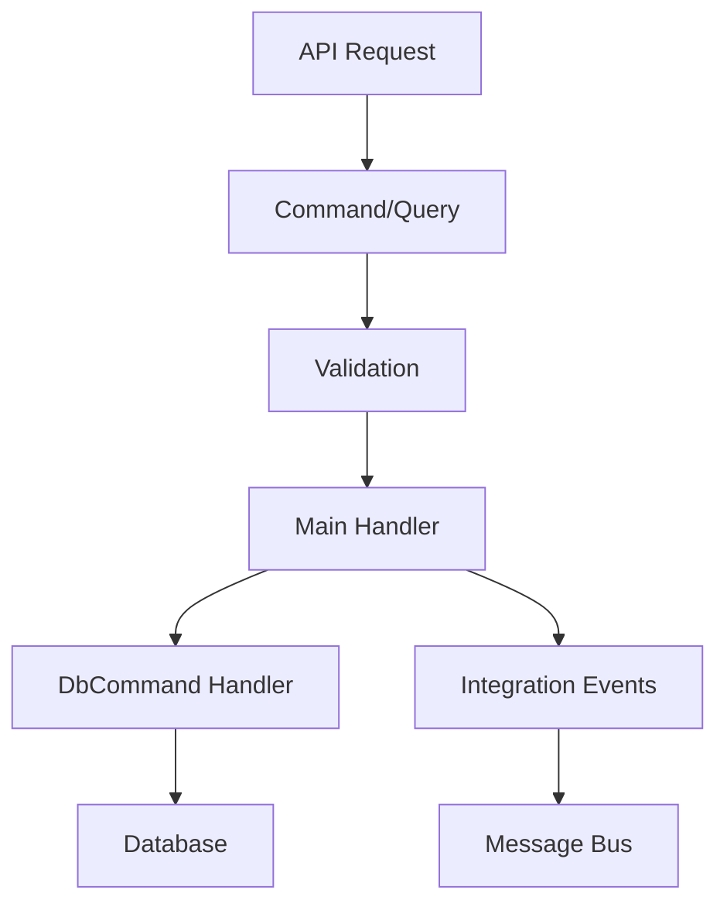

# Handlers in Momentum

Handlers are the core execution units in Momentum's CQRS implementation. They contain your business logic and coordinate between different layers of your application.

## Handler Architecture

Momentum uses a specific handler architecture that separates concerns and promotes testability:



## Handler Types

### Command Handlers

Command handlers orchestrate write operations and return results with optional integration events:

```csharp
public static class CreateCashierCommandHandler
{
    // Database command definition
    public record DbCommand(Data.Entities.Cashier Cashier) : ICommand<Data.Entities.Cashier>;

    // Main handler - orchestrates the operation
    public static async Task<(Result<Cashier>, CashierCreated?)> Handle(
        CreateCashierCommand command, 
        IMessageBus messaging,
        CancellationToken cancellationToken)
    {
        // Create database command
        var dbCommand = CreateInsertCommand(command);
        
        // Execute database operation
        var insertedCashier = await messaging.InvokeCommandAsync(dbCommand, cancellationToken);

        // Transform to domain model
        var result = insertedCashier.ToModel();
        
        // Create integration event
        var createdEvent = new CashierCreated(result.TenantId, PartitionKeyTest: 0, result);

        return (result, createdEvent);
    }

    // Database handler - performs the actual data operation
    public static async Task<Data.Entities.Cashier> Handle(
        DbCommand command, 
        AppDomainDb db, 
        CancellationToken cancellationToken)
    {
        return await db.Cashiers.InsertWithOutputAsync(command.Cashier, token: cancellationToken);
    }

    // Helper method to create database command
    private static DbCommand CreateInsertCommand(CreateCashierCommand command) =>
        new(new Data.Entities.Cashier
        {
            TenantId = command.TenantId,
            CashierId = Guid.CreateVersion7(),
            Name = command.Name,
            Email = command.Email,
            CreatedDateUtc = DateTime.UtcNow,
            UpdatedDateUtc = DateTime.UtcNow
        });
}
```

### Query Handlers

Query handlers are simpler and typically access the database directly:

```csharp
public static class GetCashierQueryHandler
{
    public static async Task<Result<Cashier>> Handle(
        GetCashierQuery query, 
        AppDomainDb db, 
        CancellationToken cancellationToken)
    {
        var cashier = await db.Cashiers
            .FirstOrDefaultAsync(c => c.TenantId == query.TenantId && c.CashierId == query.Id, cancellationToken);

        if (cashier is not null)
        {
            return cashier.ToModel();
        }

        return new List<ValidationFailure> { new("Id", "Cashier not found") };
    }
}
```

## Handler Registration

Handlers are automatically discovered and registered by Momentum through the `DomainAssembly` attribute:

```csharp
// In your API project's Program.cs or AssemblyInfo.cs
using AppDomain;

[assembly: DomainAssembly(typeof(IAppDomainAssembly))]
```

This enables:
- Automatic handler discovery
- Dependency injection registration
- Validation integration
- Message routing

## Handler Execution Flow

### Command Execution Flow

1. **Request arrives** at API endpoint
2. **Command validation** runs (FluentValidation)
3. **Main handler executes** with business logic
4. **Database handler executes** for data operations
5. **Integration event published** (if returned)
6. **Result returned** to caller

### Query Execution Flow

1. **Request arrives** at API endpoint
2. **Query validation** runs (if configured)
3. **Query handler executes** with database access
4. **Result returned** to caller

## Advanced Handler Patterns

### Complex Command Handler

Here's a more complex command handler that demonstrates advanced patterns:

```csharp
public static class UpdateInvoiceCommandHandler
{
    public record DbCommand(Data.Entities.Invoice Invoice) : ICommand<Data.Entities.Invoice>;

    public static async Task<(Result<Invoice>, InvoiceUpdated?)> Handle(
        UpdateInvoiceCommand command, 
        IMessageBus messaging,
        CancellationToken cancellationToken)
    {
        // 1. Fetch existing invoice
        var getQuery = new GetInvoiceQuery(command.TenantId, command.Id);
        var existingResult = await messaging.InvokeAsync(getQuery, cancellationToken);

        if (!existingResult.IsSuccess)
        {
            return (existingResult, null);
        }

        var existing = existingResult.Value;

        // 2. Business rule validation
        if (existing.Status == InvoiceStatus.Paid)
        {
            return (Result<Invoice>.Failure("Cannot update paid invoice"), null);
        }

        // 3. Check if cashier exists (if changing cashier)
        if (command.CashierId != existing.CashierId)
        {
            var cashierQuery = new GetCashierQuery(command.TenantId, command.CashierId);
            var cashierResult = await messaging.InvokeAsync(cashierQuery, cancellationToken);
            
            if (!cashierResult.IsSuccess)
            {
                return (Result<Invoice>.Failure("Invalid cashier"), null);
            }
        }

        // 4. Create and execute database command
        var dbCommand = CreateUpdateCommand(command, existing);
        var updatedInvoice = await messaging.InvokeCommandAsync(dbCommand, cancellationToken);

        // 5. Create integration event
        var result = updatedInvoice.ToModel();
        var updatedEvent = new InvoiceUpdated(result.TenantId, result);

        return (result, updatedEvent);
    }

    public static async Task<Data.Entities.Invoice> Handle(
        DbCommand command, 
        AppDomainDb db, 
        CancellationToken cancellationToken)
    {
        return await db.Invoices
            .Where(i => i.InvoiceId == command.Invoice.InvoiceId)
            .UpdateWithOutputAsync(
                _ => new Data.Entities.Invoice
                {
                    Amount = command.Invoice.Amount,
                    Description = command.Invoice.Description,
                    CashierId = command.Invoice.CashierId,
                    UpdatedDateUtc = DateTime.UtcNow
                },
                token: cancellationToken);
    }

    private static DbCommand CreateUpdateCommand(UpdateInvoiceCommand command, Invoice existing) =>
        new(new Data.Entities.Invoice
        {
            InvoiceId = existing.Id,
            TenantId = existing.TenantId,
            Amount = command.Amount,
            Description = command.Description,
            CashierId = command.CashierId,
            Status = existing.Status,
            CreatedDateUtc = existing.CreatedDate,
            UpdatedDateUtc = DateTime.UtcNow
        });
}
```

### Handler with External Service Integration

```csharp
public static class ProcessPaymentCommandHandler
{
    public record DbCommand(Guid InvoiceId, InvoiceStatus Status, DateTime PaidDate) : ICommand<Data.Entities.Invoice>;

    public static async Task<(Result<Invoice>, InvoicePaymentProcessed?)> Handle(
        ProcessPaymentCommand command, 
        IMessageBus messaging,
        IPaymentService paymentService,
        ILogger<ProcessPaymentCommandHandler> logger,
        CancellationToken cancellationToken)
    {
        try
        {
            // 1. Get invoice
            var getQuery = new GetInvoiceQuery(command.TenantId, command.InvoiceId);
            var invoiceResult = await messaging.InvokeAsync(getQuery, cancellationToken);

            if (!invoiceResult.IsSuccess)
            {
                return (invoiceResult, null);
            }

            var invoice = invoiceResult.Value;

            // 2. Business rules
            if (invoice.Status == InvoiceStatus.Paid)
            {
                return (Result<Invoice>.Failure("Invoice is already paid"), null);
            }

            // 3. Process payment with external service
            logger.LogInformation("Processing payment for invoice {InvoiceId}", command.InvoiceId);
            
            var paymentResult = await paymentService.ProcessPaymentAsync(
                invoice.Id, 
                invoice.Amount, 
                command.PaymentDetails, 
                cancellationToken);

            if (!paymentResult.IsSuccessful)
            {
                logger.LogWarning("Payment failed for invoice {InvoiceId}: {Error}", 
                    command.InvoiceId, paymentResult.ErrorMessage);
                
                return (Result<Invoice>.Failure($"Payment failed: {paymentResult.ErrorMessage}"), null);
            }

            // 4. Update database
            var dbCommand = new DbCommand(invoice.Id, InvoiceStatus.Paid, DateTime.UtcNow);
            var updatedInvoice = await messaging.InvokeCommandAsync(dbCommand, cancellationToken);

            // 5. Create integration event
            var result = updatedInvoice.ToModel();
            var paymentProcessedEvent = new InvoicePaymentProcessed(
                result.TenantId, 
                result.Id, 
                paymentResult.TransactionId);

            logger.LogInformation("Payment processed successfully for invoice {InvoiceId}", command.InvoiceId);

            return (result, paymentProcessedEvent);
        }
        catch (Exception ex)
        {
            logger.LogError(ex, "Error processing payment for invoice {InvoiceId}", command.InvoiceId);
            return (Result<Invoice>.Failure("Payment processing failed due to system error"), null);
        }
    }

    public static async Task<Data.Entities.Invoice> Handle(
        DbCommand command, 
        AppDomainDb db, 
        CancellationToken cancellationToken)
    {
        return await db.Invoices
            .Where(i => i.InvoiceId == command.InvoiceId)
            .UpdateWithOutputAsync(
                _ => new Data.Entities.Invoice
                {
                    Status = command.Status,
                    PaidDateUtc = command.PaidDate,
                    UpdatedDateUtc = DateTime.UtcNow
                },
                token: cancellationToken);
    }
}
```

## Handler Testing

### Unit Testing Main Handlers

```csharp
[Test]
public async Task Handle_ValidCommand_ReturnsSuccessResult()
{
    // Arrange
    var command = new CreateCashierCommand(
        TenantId: Guid.NewGuid(),
        Name: "John Doe",
        Email: "john@example.com"
    );

    var mockMessaging = new Mock<IMessageBus>();
    var expectedEntity = new Data.Entities.Cashier
    {
        CashierId = Guid.NewGuid(),
        Name = command.Name,
        Email = command.Email
    };

    mockMessaging
        .Setup(m => m.InvokeCommandAsync(It.IsAny<CreateCashierCommandHandler.DbCommand>(), It.IsAny<CancellationToken>()))
        .ReturnsAsync(expectedEntity);

    // Act
    var (result, integrationEvent) = await CreateCashierCommandHandler.Handle(command, mockMessaging.Object, CancellationToken.None);

    // Assert
    result.IsSuccess.Should().BeTrue();
    result.Value.Name.Should().Be(command.Name);
    result.Value.Email.Should().Be(command.Email);
    integrationEvent.Should().NotBeNull();
    integrationEvent!.TenantId.Should().Be(command.TenantId);
}
```

### Integration Testing Database Handlers

```csharp
[Test]
public async Task Handle_DbCommand_InsertsAndReturnsEntity()
{
    // Arrange
    using var testContext = new TestContext();
    var db = testContext.CreateDatabase<AppDomainDb>();

    var entity = new Data.Entities.Cashier
    {
        TenantId = Guid.NewGuid(),
        CashierId = Guid.NewGuid(),
        Name = "Jane Doe",
        Email = "jane@example.com",
        CreatedDateUtc = DateTime.UtcNow,
        UpdatedDateUtc = DateTime.UtcNow
    };

    var command = new CreateCashierCommandHandler.DbCommand(entity);

    // Act
    var result = await CreateCashierCommandHandler.Handle(command, db, CancellationToken.None);

    // Assert
    result.Should().NotBeNull();
    result.CashierId.Should().Be(entity.CashierId);
    result.Name.Should().Be(entity.Name);
    result.Email.Should().Be(entity.Email);

    // Verify it was actually inserted
    var inserted = await db.Cashiers.FirstOrDefaultAsync(c => c.CashierId == entity.CashierId);
    inserted.Should().NotBeNull();
}
```

## Error Handling in Handlers

### Graceful Error Handling

```csharp
public static async Task<(Result<Invoice>, InvoiceCreated?)> Handle(
    CreateInvoiceCommand command, 
    IMessageBus messaging,
    CancellationToken cancellationToken)
{
    try
    {
        // Verify cashier exists
        var cashierQuery = new GetCashierQuery(command.TenantId, command.CashierId);
        var cashierResult = await messaging.InvokeAsync(cashierQuery, cancellationToken);

        if (!cashierResult.IsSuccess)
        {
            return (Result<Invoice>.Failure("Invalid cashier specified"), null);
        }

        // Business rule validation
        if (command.Amount <= 0)
        {
            return (Result<Invoice>.Failure("Invoice amount must be greater than zero"), null);
        }

        // Execute database operation
        var dbCommand = CreateInsertCommand(command);
        var insertedInvoice = await messaging.InvokeCommandAsync(dbCommand, cancellationToken);

        var result = insertedInvoice.ToModel();
        var createdEvent = new InvoiceCreated(result.TenantId, result);

        return (result, createdEvent);
    }
    catch (Exception ex) when (ex is not OperationCanceledException)
    {
        // Log the exception but don't expose internal details
        return (Result<Invoice>.Failure("An error occurred while creating the invoice"), null);
    }
}
```

### Database Error Handling

```csharp
public static async Task<Data.Entities.Cashier> Handle(
    DbCommand command, 
    AppDomainDb db, 
    CancellationToken cancellationToken)
{
    try
    {
        return await db.Cashiers.InsertWithOutputAsync(command.Cashier, token: cancellationToken);
    }
    catch (SqlException ex) when (ex.Number == 2627) // Unique constraint violation
    {
        throw new InvalidOperationException("A cashier with this email already exists");
    }
    catch (SqlException ex) when (ex.Number == 547) // Foreign key violation
    {
        throw new InvalidOperationException("Invalid tenant specified");
    }
}
```

## Handler Dependencies

### Injecting Services

Handlers can receive dependencies through method parameters:

```csharp
public static async Task<(Result<User>, UserCreated?)> Handle(
    CreateUserCommand command,
    IMessageBus messaging,
    IEmailService emailService,
    IUserValidationService validationService,
    ILogger<CreateUserCommandHandler> logger,
    CancellationToken cancellationToken)
{
    // Use injected services
    var isValid = await validationService.ValidateUserAsync(command.Email, cancellationToken);
    if (!isValid)
    {
        return (Result<User>.Failure("Invalid user data"), null);
    }

    // ... handler logic ...

    // Send welcome email
    await emailService.SendWelcomeEmailAsync(result.Value.Email, cancellationToken);

    logger.LogInformation("User created: {UserId}", result.Value.Id);

    return (result, createdEvent);
}
```

## Best Practices

### Handler Design

1. **Single Responsibility**: Each handler should do one thing well
2. **Fail Fast**: Validate inputs early and return meaningful errors
3. **Use Transactions**: Database operations should be atomic
4. **Log Appropriately**: Log important operations and errors

### Performance

1. **Use Async/Await**: Don't block threads
2. **Optimize Database Queries**: Use projections and indexes
3. **Cache When Appropriate**: Cache frequently accessed, rarely changing data
4. **Handle Cancellation**: Respect cancellation tokens

### Error Handling

1. **Use Result Pattern**: Consistent error handling across all handlers
2. **Don't Expose Internal Details**: Return user-friendly error messages
3. **Log Exceptions**: Always log exceptions for debugging
4. **Handle Expected Errors**: Gracefully handle business rule violations

### Testing

1. **Test Business Logic**: Unit test the main handler logic
2. **Test Database Operations**: Integration test database handlers
3. **Mock External Dependencies**: Use mocks for external services
4. **Test Error Scenarios**: Ensure error handling works correctly

## Next Steps

- Learn about [Validation](./validation) integration
- Understand [Commands](./commands) in detail
- Explore [Queries](./queries) patterns
- See [Database Integration](../database/) for data access patterns