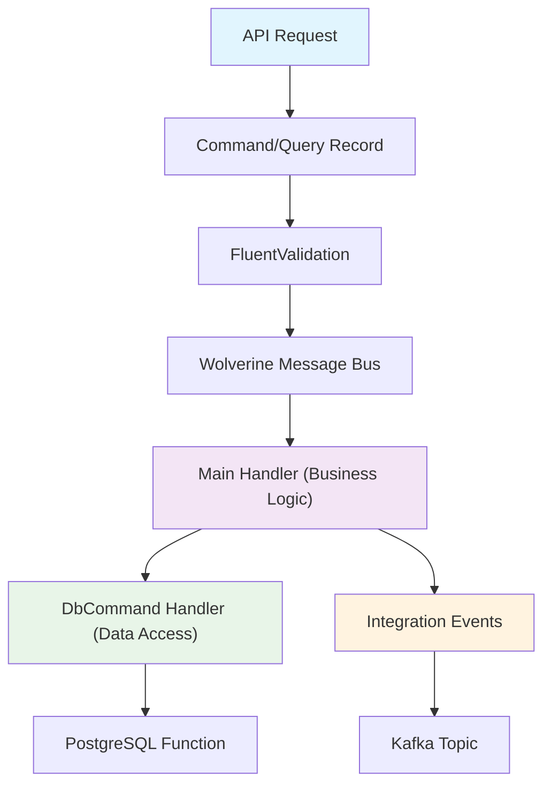

# CQRS (Command Query Responsibility Segregation)

Command Query Responsibility Segregation (CQRS) is the **core architectural pattern** in Momentum that separates read and write operations, enabling better scalability, maintainability, and domain modeling. Momentum implements CQRS using **Wolverine message bus**, **source generation**, and **multi-tenant architecture**.

## Overview

CQRS divides your application logic into two distinct responsibilities:

- **Commands**: Operations that change state (Create, Update, Delete) with business logic validation
- **Queries**: Operations that read data without side effects, optimized for specific scenarios

### Key Momentum Features

| Feature | Purpose | Benefits |
|---------|---------|----------|
| **Wolverine Message Bus** | CQRS orchestration and handler discovery | High-performance message processing, automatic registration |
| **Source Generation** | Compile-time database access code generation | Type safety, performance, reduced boilerplate |
| **Multi-Tenant Architecture** | Tenant-isolated data access with composite keys | Secure data separation, scalable SaaS architecture |
| **Result\<T\> Pattern** | Explicit error handling without exceptions | Predictable error flows, better API responses |
| **Function-Based Database Access** | PostgreSQL functions with `$` prefix convention | Optimized database operations, maintainable SQL |

## Architecture Overview



## Core Concepts

### Commands
[Commands](./commands) represent business actions that modify application state using the **two-tier handler pattern**:

```csharp
// Business command
public record CreateOrderCommand(Guid TenantId, Guid CustomerId, IReadOnlyList<OrderItem> Items) 
    : ICommand<Result<Order>>;

// Main handler - business logic
public static async Task<(Result<Order>, OrderCreated?)> Handle(
    CreateOrderCommand command,
    IMessageBus messaging,
    CancellationToken cancellationToken)
{
    // Business validation and orchestration
    var dbCommand = new DbCommand(command.TenantId, command.CustomerId, JsonSerializer.Serialize(command.Items));
    var result = await messaging.InvokeAsync(dbCommand, cancellationToken);
    
    if (result.IsFailure) return (result, null);
    
    var order = await GetCreatedOrder(result.Value);
    var integrationEvent = new OrderCreated(order.TenantId, order.OrderId, order.CustomerId);
    
    return (Result.Success(order), integrationEvent);
}

// Database handler with source generation
[DbCommand(fn: "$app_domain.orders_create")]
public partial record DbCommand(Guid TenantId, Guid CustomerId, string ItemsJson) 
    : ICommand<Result<Guid>>;
```

### Queries
[Queries](./queries) retrieve data efficiently with **multi-tenant isolation** and **projection optimization**:

```csharp
// Query with pagination
public record GetOrdersByCustomerQuery(Guid TenantId, Guid CustomerId, int Limit = 10, int Offset = 0) 
    : IQuery<IEnumerable<OrderSummary>>;

// Handler with direct database access
public static async Task<IEnumerable<OrderSummary>> Handle(
    GetOrdersByCustomerQuery query,
    IMessageBus messaging,
    CancellationToken cancellationToken)
{
    var dbQuery = new DbQuery(query.TenantId, query.CustomerId, query.Limit, query.Offset);
    var orders = await messaging.InvokeAsync(dbQuery, cancellationToken);
    
    return orders.Select(o => new OrderSummary(o.OrderId, o.OrderDate, o.TotalAmount, o.Status));
}

// Source-generated database query
[DbCommand(fn: "$app_domain.orders_get_by_customer")]
public partial record DbQuery(Guid TenantId, Guid CustomerId, int Limit, int Offset) 
    : IQuery<IEnumerable<Data.Entities.Order>>;
```

### Handlers
[Handlers](./handlers) contain business logic and are **automatically discovered** through Wolverine's assembly scanning:

```csharp
// Assembly registration enables automatic handler discovery
[assembly: DomainAssembly(typeof(IAppDomainAssembly))]

// Static handler classes with method-based dependency injection
public static class UpdateOrderStatusCommandHandler
{
    public static async Task<Result<Order>> Handle(
        UpdateOrderStatusCommand command,
        IMessageBus messaging,
        ILogger<UpdateOrderStatusCommandHandler> logger,
        CancellationToken cancellationToken)
    {
        // Handlers receive dependencies as method parameters
        logger.LogInformation("Updating order {OrderId} status to {Status}", command.OrderId, command.NewStatus);
        
        // Business logic implementation
    }
}
```

### Validation
[Validation](./validation) uses **FluentValidation** with **automatic execution** before handlers:

```csharp
public class CreateOrderCommandValidator : AbstractValidator<CreateOrderCommand>
{
    public CreateOrderCommandValidator()
    {
        RuleFor(x => x.TenantId).NotEmpty().WithMessage("Tenant ID is required");
        RuleFor(x => x.CustomerId).NotEmpty().WithMessage("Customer ID is required");
        RuleFor(x => x.Items).NotEmpty().WithMessage("Order must contain at least one item");
        
        RuleForEach(x => x.Items).ChildRules(item => {
            item.RuleFor(x => x.Quantity).GreaterThan(0).WithMessage("Quantity must be positive");
            item.RuleFor(x => x.UnitPrice).GreaterThanOrEqualTo(0).WithMessage("Price cannot be negative");
        });
    }
}
```

## Multi-Tenant Architecture

All entities use **composite primary keys** with `TenantId` for complete data isolation:

```sql
-- Multi-tenant table structure
CREATE TABLE app_domain.orders (
    tenant_id UUID NOT NULL,
    order_id UUID NOT NULL,
    customer_id UUID NOT NULL,
    total_amount DECIMAL(12,2) NOT NULL,
    
    -- Composite primary key ensures tenant isolation
    PRIMARY KEY (tenant_id, order_id)
);

-- All queries must include tenant context
CREATE OR REPLACE FUNCTION app_domain.orders_get_by_customer(
    p_tenant_id UUID,
    p_customer_id UUID,
    p_limit INTEGER DEFAULT 10,
    p_offset INTEGER DEFAULT 0
) RETURNS TABLE(...) AS $$
BEGIN
    RETURN QUERY
    SELECT o.tenant_id, o.order_id, o.customer_id, o.total_amount
    FROM app_domain.orders o
    WHERE o.tenant_id = p_tenant_id 
      AND o.customer_id = p_customer_id
    ORDER BY o.order_date DESC
    LIMIT p_limit OFFSET p_offset;
END;
$$ LANGUAGE plpgsql;
```

## Source Generation Patterns

Momentum uses **compile-time source generation** for type-safe, high-performance database access:

```csharp
// The [DbCommand] attribute triggers source generation
[DbCommand(fn: "$app_domain.orders_create")]
public partial record CreateOrderDbCommand(
    Guid TenantId, 
    Guid CustomerId, 
    string ItemsJson
) : ICommand<Result<Guid>>;

// Generated code (conceptual):
public partial record CreateOrderDbCommand
{
    public static async Task<Result<Guid>> Handle(
        CreateOrderDbCommand command,
        IDbConnection connection,
        CancellationToken cancellationToken)
    {
        // Auto-generated SQL: SELECT * FROM app_domain.orders_create(@TenantId, @CustomerId, @ItemsJson)
        var result = await connection.QuerySingleAsync<Guid>(
            "SELECT * FROM app_domain.orders_create(@TenantId, @CustomerId, @ItemsJson)",
            command,
            cancellationToken);
        
        return Result.Success(result);
    }
}
```

## Integration with Momentum

Momentum provides a complete CQRS implementation with:

### Message Bus Integration
- **Wolverine**: High-performance message handling and routing
- **Automatic Discovery**: Handlers discovered through assembly scanning
- **Dependency Injection**: Method-parameter based DI for handlers
- **Pipeline Integration**: Automatic validation and error handling

### Database Integration
- **Source Generation**: Compile-time database command generation
- **Function-Based Access**: PostgreSQL functions with `$` prefix convention
- **Multi-Tenant Support**: Automatic tenant isolation in all operations
- **Result\<T\> Pattern**: Explicit error handling without exceptions

### Event-Driven Architecture
- **Domain Events**: Internal bounded context communication
- **Integration Events**: Cross-service communication via Kafka
- **Automatic Publishing**: Events published when commands succeed
- **CloudEvents Format**: Standardized event format for interoperability

### Validation Framework
- **FluentValidation**: Declarative validation rules
- **Automatic Execution**: Validation runs before handler execution
- **Early Returns**: Invalid commands/queries fail fast
- **Custom Messages**: User-friendly validation error messages

## Getting Started

### 1. Define Domain Structure
```csharp
// Domain entities with multi-tenant support
[Table(Schema = "app_domain", Name = "orders")]
public record Order : DbEntity
{
    [PrimaryKey(Order = 0)] [Column("tenant_id")] public Guid TenantId { get; set; }
    [PrimaryKey(Order = 1)] [Column("order_id")] public Guid OrderId { get; set; }
    [Column("customer_id")] public Guid CustomerId { get; set; }
    [Column("total_amount")] public decimal TotalAmount { get; set; }
}
```

### 2. Create Commands and Queries
```csharp
// Commands modify state
public record CreateOrderCommand(Guid TenantId, Guid CustomerId, IReadOnlyList<OrderItem> Items) 
    : ICommand<Result<Order>>;

// Queries read data
public record GetOrderByIdQuery(Guid TenantId, Guid OrderId) : IQuery<Order?>;
```

### 3. Implement Handlers
```csharp
public static partial class CreateOrderCommandHandler
{
    // Source-generated database command
    [DbCommand(fn: "$app_domain.orders_create")]
    public partial record DbCommand(Guid TenantId, Guid CustomerId, string ItemsJson) 
        : ICommand<Result<Guid>>;

    // Business logic handler
    public static async Task<Result<Order>> Handle(
        CreateOrderCommand command,
        IMessageBus messaging,
        CancellationToken cancellationToken)
    {
        // Implementation
    }
}
```

### 4. Add Validation
```csharp
public class CreateOrderCommandValidator : AbstractValidator<CreateOrderCommand>
{
    public CreateOrderCommandValidator()
    {
        RuleFor(x => x.TenantId).NotEmpty();
        RuleFor(x => x.Items).NotEmpty();
    }
}
```

### 5. Register with Momentum
```csharp
// Assembly attribute enables automatic discovery
[assembly: DomainAssembly(typeof(IAppDomainAssembly))]

// Service registration
builder.Services.AddMomentumServiceDefaults(builder.Configuration);
```

## Benefits

The CQRS pattern in Momentum provides significant advantages:

- **Scalability**: Read and write operations can be scaled independently through different database optimization strategies
- **Performance**: Queries are optimized for specific read patterns using projections and database functions
- **Maintainability**: Clear separation of concerns with business logic isolated from data access
- **Testability**: Handlers can be easily unit tested in isolation with mocked dependencies
- **Domain Modeling**: Commands represent clear business intentions with explicit validation rules
- **Multi-Tenancy**: Built-in tenant isolation ensures secure data separation
- **Type Safety**: Source generation provides compile-time validation of database operations
- **Event-Driven**: Integration events enable loose coupling between bounded contexts

## Next Steps

Now that you understand CQRS fundamentals in Momentum, explore these topics:

### Core Implementation
- **[Commands](./commands)** - Write operations with business logic and validation
- **[Queries](./queries)** - Read operations with optimization and caching
- **[Handlers](./handlers)** - Business logic implementation and testing patterns
- **[Validation](./validation)** - FluentValidation integration and error handling

### Advanced Topics
- **[Adding Domains](../adding-domains/index.md)** - Complete guide to adding new business domains
- **[Database Access](../database/index.md)** - Multi-tenant database patterns and source generation
- **[Messaging](../messaging/index.md)** - Event-driven architecture with Kafka integration
- **[Service Configuration](../service-configuration/index.md)** - Wolverine setup and observability

### Testing and Quality
- **[Testing](../testing/index.md)** - Unit and integration testing strategies for CQRS
- **[Template Walkthrough](../template-walkthrough/index.md)** - End-to-end implementation examples