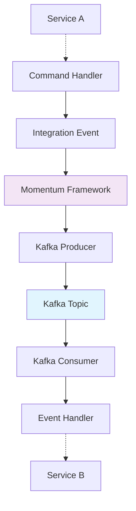

# Kafka Configuration in Momentum

Apache Kafka serves as the **message broker** for integration events in Momentum, enabling reliable, scalable communication between microservices with automatic configuration and CloudEvents support.

> **Prerequisites**: Understanding of [Integration Events](./integration-events) and [Commands](../cqrs/commands). New to messaging? Start with our [Getting Started Guide](../getting-started).

## Kafka Integration Overview

Momentum provides **seamless Kafka integration** with minimal configuration required:

### Key Features

| Feature                     | Description                               | Benefits                        |
| --------------------------- | ----------------------------------------- | ------------------------------- |
| **Automatic Configuration** | Zero-config setup with connection strings | Quick development setup         |
| **Topic Auto-Provisioning** | Topics created based on event attributes  | No manual topic management      |
| **CloudEvents Standard**    | Messages use CloudEvents specification    | Cross-platform interoperability |
| **Consumer Groups**         | Automatic consumer group assignment       | Scalable message processing     |
| **Health Monitoring**       | Built-in connectivity health checks       | Production monitoring           |
| **Partition Strategies**    | Configurable partition key strategies     | Message ordering guarantees     |

### Architecture Integration



## Configuration

### Connection String

Configure Kafka in your application settings:

```json
// appsettings.json
{
    "ConnectionStrings": {
        "Messaging": "localhost:9092"
    }
}
```

### Environment-Specific Configuration

```json
// appsettings.Development.json
{
  "ConnectionStrings": {
    "Messaging": "localhost:9092"
  }
}

// appsettings.Production.json
{
  "ConnectionStrings": {
    "Messaging": "prod-kafka-cluster:9092"
  }
}
```

### Advanced Kafka Settings

For more complex scenarios, you can configure additional Kafka options:

```json
{
    "ConnectionStrings": {
        "Messaging": "broker1:9092,broker2:9092,broker3:9092"
    },
    "Kafka": {
        "SecurityProtocol": "SaslSsl",
        "SaslMechanism": "Plain",
        "SaslUsername": "your-username",
        "SaslPassword": "your-password",
        "SslCaLocation": "/path/to/ca-cert.pem"
    }
}
```

## Topic Management and Naming

### Automatic Topic Creation

Momentum automatically creates Kafka topics based on your **integration event definitions**:

```csharp
[EventTopic<Cashier>]
public record CashierCreated(
    [PartitionKey] Guid TenantId,
    Cashier Cashier
);
```

This creates a topic named: `dev.appdomain.public.cashiers`

### Topic Naming Strategy

Momentum uses a **structured naming convention** that ensures clarity and prevents conflicts:

#### Naming Pattern

```
{environment}.{domain}.{scope}.{topic}.{version}
```

#### Component Breakdown

| Component       | Values                  | Purpose                   | Example     |
| --------------- | ----------------------- | ------------------------- | ----------- |
| **Environment** | `dev`, `test`, `prod`   | Environment isolation     | `dev`       |
| **Domain**      | Business domain name    | Logical grouping          | `appdomain` |
| **Scope**       | `public`, `internal`    | Visibility control        | `public`    |
| **Topic**       | Event name (pluralized) | Event type identification | `cashiers`  |
| **Version**     | `v1`, `v2`, etc.        | Schema versioning         | `v1`        |

#### Example Topic Names

```
dev.appdomain.public.cashiers        # Development cashier events
prod.billing.public.invoices.v2      # Production billing events v2
test.notifications.internal.emails   # Test internal email events
```

### Custom Topic Configuration

Override default naming with explicit configuration:

```csharp
// Custom topic configuration
[EventTopic<Invoice>(
    Topic = "invoice-events",           // Custom topic name
    Domain = "billing",                 // Custom domain
    Version = "v2",                     // Specific version
    Internal = false,                   // Public scope
    ShouldPluralizeTopicName = false    // Don't pluralize
)]
public record InvoiceUpdated(
    [PartitionKey] Guid TenantId,
    Invoice Invoice
);

// Results in topic: dev.billing.public.invoice-events.v2
```

### Topic Configuration Examples

```csharp
// Standard public event
[EventTopic<User>]
public record UserCreated([PartitionKey] Guid TenantId, User User);
// Topic: dev.appdomain.public.users

// Internal service event
[EventTopic<Order>(Internal = true)]
public record OrderValidated([PartitionKey] Guid TenantId, Guid OrderId);
// Topic: dev.appdomain.internal.orders

// Versioned event
[EventTopic<Payment>(Version = "v2")]
public record PaymentProcessed([PartitionKey] Guid TenantId, Payment Payment);
// Topic: dev.appdomain.public.payments.v2

// Custom domain event
[EventTopic<Notification>(Domain = "communications")]
public record EmailSent([PartitionKey] Guid TenantId, string Email);
// Topic: dev.communications.public.notifications
```

## Partition Strategy and Message Ordering

### Understanding Partition Keys

Partition keys are **critical for message ordering** and load distribution:

```csharp
// Single partition key
[EventTopic<Cashier>]
public record CashierCreated(
    [PartitionKey] Guid TenantId,  // Messages with same TenantId go to same partition
    Cashier Cashier
);

// Multiple partition keys (combined)
[EventTopic<Order>]
public record OrderCreated(
    [PartitionKey(Order = 0)] Guid TenantId,     // Primary key
    [PartitionKey(Order = 1)] Guid CustomerId,   // Secondary key
    Order Order
);
```

### Why Partition Keys Matter

| Benefit                 | Description                                    | Use Case                  |
| ----------------------- | ---------------------------------------------- | ------------------------- |
| **Ordering Guarantees** | Same key = same partition = ordered processing | User state changes        |
| **Load Distribution**   | Different keys spread across partitions        | Even resource utilization |
| **Tenant Isolation**    | Tenant-specific processing streams             | Multi-tenant applications |
| **Scalability**         | More partitions = more parallel consumers      | High-throughput scenarios |
| **Failure Isolation**   | Partition failures don't affect others         | Resilient processing      |

### Partition Key Strategies

```csharp
// Strategy 1: Single partition key (tenant isolation)
[EventTopic<Cashier>]
public record CashierCreated(
    [PartitionKey] Guid TenantId,  // All tenant events ordered
    Cashier Cashier
);

// Strategy 2: Composite partition key (tenant + entity)
[EventTopic<Order>]
public record OrderCreated(
    [PartitionKey(Order = 0)] Guid TenantId,     // Primary partitioning
    [PartitionKey(Order = 1)] Guid CustomerId,   // Secondary partitioning
    Order Order
);

// Strategy 3: Entity-specific partition key
[EventTopic<Payment>]
public record PaymentProcessed(
    [PartitionKey] Guid PaymentId,  // Payment-specific ordering
    Guid TenantId,
    Payment Payment
);
```

### Choosing Partition Keys

**Good partition key choices:**

-   Tenant ID (for multi-tenant applications)
-   User ID (for user-specific events)
-   Order ID (for order processing)
-   Region ID (for geographic distribution)

**Avoid:**

-   Timestamp-based keys (creates hot partitions)
-   Sequential numbers (uneven distribution)
-   Null or empty values

## Consumer Configuration and Processing

### Automatic Consumer Groups

Momentum automatically assigns **unique consumer groups** per service:

```csharp
// Service name becomes consumer group ID
var builder = WebApplication.CreateBuilder(args);
builder.AddServiceDefaults(); // Configures consumer group as service name

var app = builder.Build();
// Consumer group: "MyInvoiceService" (based on application name)
```

### Default Consumer Configuration

Momentum provides **production-ready defaults** for Kafka consumers:

```csharp
// Default consumer configuration
consumer.GroupId = options.ServiceName;           // Service name as group ID
consumer.AutoOffsetReset = AutoOffsetReset.Latest; // Start from latest messages
consumer.EnableAutoCommit = true;                  // Automatically commit offsets
consumer.EnableAutoOffsetStore = false;           // Manual offset storage
```

### Custom Consumer Configuration

For advanced scenarios, you can customize consumer settings:

```csharp
// In Program.cs or startup configuration
builder.AddWolverine(opts =>
{
    opts.UseKafka("localhost:9092")
        .ConfigureConsumers(consumer =>
        {
            consumer.GroupId = "custom-group-name";
            consumer.AutoOffsetReset = AutoOffsetReset.Earliest;
            consumer.EnableAutoCommit = false; // Manual commit
            consumer.SessionTimeoutMs = 30000;
            consumer.HeartbeatIntervalMs = 3000;
        });
});
```

## Message Format and Standards

### CloudEvents Specification

Momentum uses the **CloudEvents standard** for message format consistency:

```json
{
    "specversion": "1.0",
    "type": "CashierCreated",
    "source": "appdomain-api",
    "id": "550e8400-e29b-41d4-a716-446655440000",
    "time": "2024-01-15T10:30:00Z",
    "datacontenttype": "application/json",
    "subject": "tenant/123e4567-e89b-12d3-a456-426614174000",
    "data": {
        "tenantId": "123e4567-e89b-12d3-a456-426614174000",
        "partitionKeyTest": 0,
        "cashier": {
            "id": "456e7890-e12b-34c5-d678-901234567890",
            "name": "John Doe",
            "email": "john.doe@example.com",
            "createdDate": "2024-01-15T10:30:00Z"
        }
    }
}
```

### Standard Message Headers

Momentum automatically adds **CloudEvents headers** to all messages:

```csharp
// Headers automatically added
"ce-specversion": "1.0"
"ce-type": "CashierCreated"
"ce-source": "appdomain-api"
"ce-id": "unique-message-id"
"ce-time": "2024-01-15T10:30:00Z"
"content-type": "application/cloudevents+json"
```

## Error Handling

### Retry Configuration

Configure retry policies for Kafka consumers:

```csharp
builder.AddWolverine(opts =>
{
    opts.Policies.OnException<KafkaException>()
        .Retry(3)
        .Then.Requeue();

    opts.Policies.OnException<BusinessException>()
        .MoveToErrorQueue(); // Don't retry business exceptions
});
```

### Dead Letter Topics

Failed messages are moved to dead letter topics:

```csharp
// Dead letter topic naming: {original-topic}.dead-letter
// Example: dev.appdomain.public.cashiers.dead-letter
```

### Circuit Breaker

Protect against cascading failures:

```csharp
builder.Services.AddHttpClient<IExternalService>()
    .AddStandardResilienceHandler(); // Includes circuit breaker
```

## Monitoring and Health Checks

### Health Checks

Kafka health checks are automatically configured:

```csharp
// Health check endpoint: /health
// Checks Kafka connectivity and topic accessibility
```

### Metrics

Monitor Kafka performance with built-in metrics:

```csharp
// Available metrics:
// - kafka_consumer_lag
// - kafka_messages_consumed_total
// - kafka_messages_produced_total
// - kafka_consumer_group_members
```

### Logging

Configure logging for Kafka operations:

```csharp
// appsettings.json
{
  "Logging": {
    "LogLevel": {
      "Wolverine.Kafka": "Information",
      "Confluent.Kafka": "Warning"
    }
  }
}
```

## Development and Testing

### Local Development

For local development, use Docker Compose:

```yaml
# docker-compose.yml
version: "3.8"
services:
    zookeeper:
        image: confluentinc/cp-zookeeper:latest
        environment:
            ZOOKEEPER_CLIENT_PORT: 2181
            ZOOKEEPER_TICK_TIME: 2000

    kafka:
        image: confluentinc/cp-kafka:latest
        depends_on:
            - zookeeper
        ports:
            - "9092:9092"
        environment:
            KAFKA_BROKER_ID: 1
            KAFKA_ZOOKEEPER_CONNECT: zookeeper:2181
            KAFKA_ADVERTISED_LISTENERS: PLAINTEXT://localhost:9092
            KAFKA_OFFSETS_TOPIC_REPLICATION_FACTOR: 1
```

Start with:

```bash
docker compose up -d kafka zookeeper
```

### Testing with Testcontainers

Use Testcontainers for integration tests:

```csharp
[Test]
public async Task Should_Process_Integration_Event()
{
    // Testcontainers automatically provides Kafka for testing
    using var testContext = new IntegrationTestContext();

    var messageBus = testContext.GetService<IMessageBus>();

    // Publish event
    var cashierCreated = new CashierCreated(Guid.NewGuid(), new Cashier());
    await messageBus.PublishAsync(cashierCreated);

    // Verify processing
    await testContext.WaitForMessageProcessing();

    // Assert handler was called
    var mockHandler = testContext.GetMock<ICashierHandler>();
    mockHandler.Verify(x => x.Handle(It.IsAny<CashierCreated>(), It.IsAny<CancellationToken>()), Times.Once);
}
```

## Production Deployment

### Cluster Configuration

For production, use a Kafka cluster:

```json
{
    "ConnectionStrings": {
        "Messaging": "kafka-broker-1:9092,kafka-broker-2:9092,kafka-broker-3:9092"
    }
}
```

### Security Configuration

Configure security for production:

```json
{
    "Kafka": {
        "SecurityProtocol": "SaslSsl",
        "SaslMechanism": "Plain",
        "SaslUsername": "${KAFKA_USERNAME}",
        "SaslPassword": "${KAFKA_PASSWORD}",
        "SslEndpointIdentificationAlgorithm": "https"
    }
}
```

### Performance Tuning

Optimize for production workloads:

```csharp
builder.AddWolverine(opts =>
{
    opts.UseKafka(connectionString)
        .ConfigureProducers(producer =>
        {
            producer.BatchSize = 16384;           // Batch size for throughput
            producer.LingerMs = 5;                // Wait time for batching
            producer.CompressionType = CompressionType.Snappy; // Compression
            producer.Acks = Acks.All;             // Durability
        })
        .ConfigureConsumers(consumer =>
        {
            consumer.FetchMinBytes = 1024;        // Minimum fetch size
            consumer.FetchMaxWaitMs = 500;        // Maximum wait time
            consumer.MaxPollIntervalMs = 300000;  // Max time between polls
        });
});
```

## Troubleshooting

### Common Issues

**Connection Problems:**

```bash
# Check Kafka connectivity
docker exec -it kafka-container kafka-topics --bootstrap-server localhost:9092 --list
```

**Topic Issues:**

```bash
# Create topic manually if needed
kafka-topics --bootstrap-server localhost:9092 --create --topic dev.appdomain.public.cashiers --partitions 3 --replication-factor 1
```

**Consumer Lag:**

```bash
# Check consumer group status
kafka-consumer-groups --bootstrap-server localhost:9092 --group your-service-name --describe
```

### Debugging

Enable detailed logging:

```json
{
    "Logging": {
        "LogLevel": {
            "Wolverine": "Debug",
            "Wolverine.Kafka": "Debug",
            "Confluent.Kafka": "Debug"
        }
    }
}
```

### Performance Issues

Monitor key metrics:

-   Consumer lag
-   Message throughput
-   Error rates
-   Partition distribution

## Kafka Best Practices

### Topic Design Guidelines

#### ✅ Partition Planning

```csharp
// ✅ Good: Reasonable partition count for expected load
// For medium-load topics: 3-12 partitions
// For high-load topics: 12-50 partitions
// Rule of thumb: Plan for 10-100 MB/sec per partition

[EventTopic<User>(Partitions = 6)]  // Explicit partition count
public record UserCreated(
    [PartitionKey] Guid TenantId,
    User User
);

// ❌ Bad: Too many partitions for small topics
[EventTopic<Config>(Partitions = 100)]  // Overkill for low-volume events
public record ConfigUpdated(Config Configuration);
```

#### ✅ Partition Key Selection

```csharp
// ✅ Good: Well-distributed partition keys
public record OrderCreated(
    [PartitionKey] Guid TenantId,        // Distributes across tenants
    Guid OrderId,
    Order Order
);

public record UserActivityTracked(
    [PartitionKey] Guid UserId,          // User-specific ordering
    ActivityType Type,
    DateTime Timestamp
);

// ❌ Bad: Poor partition key choices
public record EventLogged(
    [PartitionKey] DateTime Timestamp,   // Creates hot partitions
    string EventType,
    object Data
);

public record GlobalEvent(
    [PartitionKey] string ConstantValue, // All messages to one partition
    object Data
);
```

#### ✅ Message Size Management

```csharp
// ✅ Good: Reasonably sized messages
public record UserCreated(
    [PartitionKey] Guid TenantId,
    Guid UserId,
    string Name,
    string Email,
    DateTime CreatedAt  // Essential data only
);

// ✅ Good: Large data handled separately
public record DocumentProcessed(
    [PartitionKey] Guid TenantId,
    Guid DocumentId,
    string FileName,
    long FileSize,
    string StorageLocation  // Reference to actual data
    // Actual file stored in blob storage, not in message
);

// ❌ Bad: Embedding large data
public record DocumentProcessed(
    [PartitionKey] Guid TenantId,
    Guid DocumentId,
    byte[] FileContent  // ❌ Could be MBs of data
);
```

### Consumer Design Patterns

#### ✅ Idempotent Event Handlers

```csharp
// ✅ Good: Idempotent handler
public static class UserCreatedHandler
{
    public static async Task Handle(
        UserCreated userCreated,
        IUserRepository userRepository,
        CancellationToken cancellationToken)
    {
        // Check if already processed (idempotency)
        var existingUser = await userRepository.GetByIdAsync(
            userCreated.User.Id, cancellationToken);

        if (existingUser != null)
        {
            // Already processed, safe to ignore
            return;
        }

        // Process the event
        await userRepository.CreateAsync(userCreated.User, cancellationToken);
    }
}

// ❌ Bad: Non-idempotent handler
public static class UserCreatedHandler
{
    public static async Task Handle(
        UserCreated userCreated,
        IUserRepository userRepository)
    {
        // Always creates, even if already exists
        await userRepository.CreateAsync(userCreated.User);
        // Will fail on duplicate processing
    }
}
```

#### ✅ Error Handling Strategy

```csharp
// ✅ Good: Distinguish error types
public static class OrderProcessedHandler
{
    public static async Task Handle(
        OrderProcessed orderProcessed,
        IInventoryService inventoryService,
        ILogger<OrderProcessedHandler> logger,
        CancellationToken cancellationToken)
    {
        try
        {
            await inventoryService.ReserveInventoryAsync(
                orderProcessed.OrderId,
                orderProcessed.Items,
                cancellationToken);
        }
        catch (InsufficientInventoryException ex)
        {
            // Business error - don't retry
            logger.LogWarning("Insufficient inventory for order {OrderId}: {Message}",
                orderProcessed.OrderId, ex.Message);

            // Publish compensation event
            await PublishOrderFailedEvent(orderProcessed.OrderId, ex.Message);
            return; // Don't throw - this prevents retry
        }
        catch (HttpRequestException ex) when (ex.Message.Contains("timeout"))
        {
            // Transient error - allow retry
            logger.LogWarning("Timeout calling inventory service for order {OrderId}",
                orderProcessed.OrderId);
            throw; // Re-throw for retry
        }
    }
}
```

### Security Configuration

#### Production Security Setup

```csharp
// ✅ Production Kafka security configuration
public static IHostApplicationBuilder AddKafkaSecurity(this IHostApplicationBuilder builder)
{
    builder.Services.AddWolverine(opts =>
    {
        opts.UseKafka(builder.Configuration.GetConnectionString("Kafka")!)
            .ConfigureSecurity(security =>
            {
                security.SecurityProtocol = SecurityProtocol.SaslSsl;
                security.SaslMechanism = SaslMechanism.Plain;
                security.SaslUsername = builder.Configuration["Kafka:Username"]!;
                security.SaslPassword = builder.Configuration["Kafka:Password"]!;
                security.SslCaLocation = "/etc/ssl/certs/ca-cert.pem";
                security.SslEndpointIdentificationAlgorithm = SslEndpointIdentificationAlgorithm.Https;
            });
    });

    return builder;
}
```

### Monitoring and Operations

#### Health Check Implementation

```csharp
// ✅ Comprehensive Kafka health check
public class KafkaHealthCheck : IHealthCheck
{
    private readonly IKafkaProducer _producer;
    private readonly IConfiguration _configuration;

    public async Task<HealthCheckResult> CheckHealthAsync(
        HealthCheckContext context,
        CancellationToken cancellationToken = default)
    {
        try
        {
            // Test producer connectivity
            var metadata = await _producer.GetMetadataAsync(TimeSpan.FromSeconds(5));

            var healthData = new Dictionary<string, object>
            {
                ["BrokerCount"] = metadata.Brokers.Count,
                ["TopicCount"] = metadata.Topics.Count,
                ["ClusterId"] = metadata.ClusterId
            };

            return HealthCheckResult.Healthy("Kafka is healthy", healthData);
        }
        catch (Exception ex)
        {
            return HealthCheckResult.Unhealthy("Kafka is not responding", ex);
        }
    }
}
```

## Next Steps

Now that you understand Kafka configuration, continue with these messaging topics:

### Core Messaging Concepts

1. **[Integration Events](./integration-events)** - Event definition and publishing patterns
2. **[Domain Events](./domain-events)** - Internal service messaging
3. **[Wolverine Integration](./wolverine)** - Deep dive into the messaging framework

### Advanced Configuration

4. **[Service Configuration](../service-configuration/)** - Advanced Kafka and observability setup
5. **[Error Handling](../error-handling)** - Message processing error patterns
6. **[Best Practices](../best-practices#messaging-patterns)** - Production messaging guidelines

### Testing and Operations

7. **[Testing Messaging](../testing/integration-tests#testing-events)** - Event-driven testing strategies
8. **[Troubleshooting](../troubleshooting#messaging-issues)** - Common Kafka problems and solutions
9. **[Monitoring](../service-configuration/observability)** - Kafka metrics and monitoring setup

### Cross-Cutting Concerns

10. **[CQRS Integration](../cqrs/commands#integration-events)** - Using events with commands
11. **[Database Events](../database/transactions#event-publishing)** - Transactional event publishing
