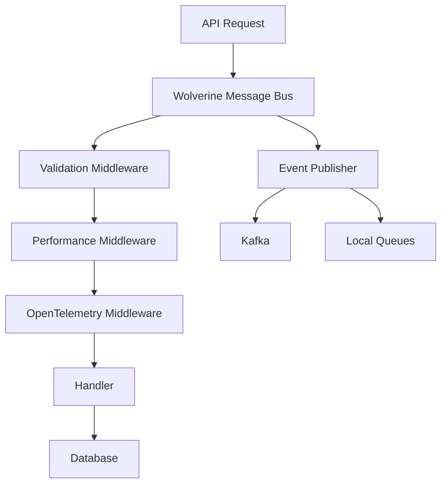

# Wolverine Integration in Momentum

Wolverine is a powerful messaging framework that serves as the backbone of Momentum's CQRS and messaging infrastructure. It provides in-process messaging, external transport integration, and advanced middleware capabilities.

## What is Wolverine?

Wolverine (formerly Jasper) is a .NET messaging framework that provides:
- **In-process messaging**: CQRS command/query handling
- **External transports**: Kafka, RabbitMQ, Azure Service Bus integration
- **Middleware pipeline**: Powerful interceptor pattern
- **Message persistence**: Reliable message delivery with PostgreSQL
- **Code generation**: High-performance handlers through source generation

## Architecture Overview



## Basic Configuration

Wolverine is automatically configured through `AddServiceDefaults()`:

```csharp
var builder = WebApplication.CreateBuilder(args);

// Automatically configures Wolverine with sensible defaults
builder.AddServiceDefaults();

var app = builder.Build();

// Wolverine commands are supported
await app.RunAsync(args);
```

### Manual Configuration

For more control, configure Wolverine manually:

```csharp
builder.Services.AddWolverine(opts =>
{
    opts.ServiceName = "MyService";
    
    // Configure PostgreSQL persistence
    opts.PersistMessagesWithPostgresql(connectionString);
    
    // Add middleware
    opts.Policies.AddMiddleware<CustomMiddleware>();
    
    // Configure discovery
    opts.Discovery.IncludeAssembly(typeof(MyDomainAssembly).Assembly);
});
```

## Handler Discovery

### Automatic Discovery

Handlers are automatically discovered from domain assemblies:

```csharp
// Mark assemblies for discovery
[assembly: DomainAssembly(typeof(IAppDomainAssembly))]

// Handlers are automatically found
public static class CreateCashierCommandHandler
{
    public static async Task<(Result<Cashier>, CashierCreated?)> Handle(
        CreateCashierCommand command, 
        IMessageBus messaging,
        CancellationToken cancellationToken)
    {
        // Handler logic
    }
}
```

### Handler Patterns

Wolverine supports various handler patterns:

```csharp
// Static method handlers (recommended)
public static class MyCommandHandler
{
    public static async Task<Result<T>> Handle(MyCommand command, CancellationToken token)
    {
        // Implementation
    }
}

// Instance method handlers
public class MyQueryHandler
{
    private readonly IDbContext _db;
    
    public MyQueryHandler(IDbContext db)
    {
        _db = db;
    }
    
    public async Task<Result<T>> Handle(MyQuery query, CancellationToken token)
    {
        // Implementation using _db
    }
}

// Multiple handlers in one class
public static class CashierHandlers
{
    public static Task<Result<Cashier>> Handle(GetCashierQuery query, AppDomainDb db, CancellationToken token)
    {
        // Query handler
    }
    
    public static Task<(Result<Cashier>, CashierCreated?)> Handle(CreateCashierCommand command, IMessageBus bus, CancellationToken token)
    {
        // Command handler
    }
}
```

## Message Bus Usage

### IMessageBus Interface

The `IMessageBus` interface provides the primary API for messaging:

```csharp
public interface IMessageBus
{
    // Execute commands/queries
    Task<TResponse> InvokeAsync<TResponse>(IQuery<TResponse> query, CancellationToken cancellationToken);
    Task<TResponse> InvokeAsync<TResponse>(ICommand<TResponse> command, CancellationToken cancellationToken);
    
    // Execute database commands
    Task<TResponse> InvokeCommandAsync<TResponse>(ICommand<TResponse> command, CancellationToken cancellationToken);
    
    // Publish events
    Task PublishAsync<T>(T message, CancellationToken cancellationToken);
    Task PublishAsync<T>(T message, DeliveryOptions? options, CancellationToken cancellationToken);
}
```

### Usage Examples

```csharp
public class CashierController : ControllerBase
{
    private readonly IMessageBus _messageBus;
    
    public CashierController(IMessageBus messageBus)
    {
        _messageBus = messageBus;
    }
    
    [HttpPost]
    public async Task<ActionResult<Cashier>> CreateCashier(CreateCashierCommand command)
    {
        var (result, integrationEvent) = await _messageBus.InvokeAsync(command);
        
        if (result.IsSuccess)
        {
            // Integration event is automatically published if returned from handler
            return CreatedAtAction(nameof(GetCashier), new { id = result.Value.Id }, result.Value);
        }
        
        return BadRequest(result.Errors);
    }
    
    [HttpGet("{id}")]
    public async Task<ActionResult<Cashier>> GetCashier(Guid id)
    {
        var query = new GetCashierQuery(GetTenantId(), id);
        var result = await _messageBus.InvokeAsync(query);
        
        if (result.IsSuccess)
        {
            return Ok(result.Value);
        }
        
        return NotFound();
    }
}
```

## Middleware Pipeline

### Built-in Middleware

Momentum configures several middleware components automatically:

```csharp
// Automatically configured middleware
opts.Policies.AddMiddleware<RequestPerformanceMiddleware>();        // Performance tracking
opts.Policies.AddMiddleware(typeof(OpenTelemetryInstrumentationMiddleware)); // Tracing
opts.Policies.Add<ExceptionHandlingPolicy>();                      // Error handling
opts.Policies.Add<FluentValidationPolicy>();                       // Validation
```

### Custom Middleware

Create custom middleware for cross-cutting concerns:

```csharp
public class AuditMiddleware
{
    public async Task InvokeAsync<T>(MessageContext context, T message, Func<Task> next)
    {
        var auditService = context.Services.GetRequiredService<IAuditService>();
        
        // Before handler execution
        var auditId = await auditService.StartAuditAsync(typeof(T).Name, message);
        
        try
        {
            await next();
            
            // After successful execution
            await auditService.CompleteAuditAsync(auditId, success: true);
        }
        catch (Exception ex)
        {
            // After failed execution
            await auditService.CompleteAuditAsync(auditId, success: false, ex.Message);
            throw;
        }
    }
}

// Register middleware
builder.Services.AddWolverine(opts =>
{
    opts.Policies.AddMiddleware<AuditMiddleware>();
});
```

### Conditional Middleware

Apply middleware conditionally:

```csharp
// Only apply to commands
opts.Policies.AddMiddleware<AuditMiddleware>(
    x => x.HandledMessageType.Implements<ICommand>()
);

// Only apply to specific handlers
opts.Policies.AddMiddleware<CachingMiddleware>(
    x => x.HandledMessageType == typeof(GetCashierQuery)
);
```

## Message Routing

### Local Message Routing

Local messages (commands/queries) are routed to handlers within the same process:

```csharp
// This stays within the process
var result = await messageBus.InvokeAsync(new GetCashierQuery(tenantId, id));
```

### External Message Routing

Integration events are routed to external transports:

```csharp
// This is published to Kafka automatically when returned from handler
public static async Task<(Result<Cashier>, CashierCreated?)> Handle(
    CreateCashierCommand command, 
    IMessageBus messaging,
    CancellationToken cancellationToken)
{
    // ... business logic
    
    var integrationEvent = new CashierCreated(tenantId, cashier);
    return (result, integrationEvent); // Automatically published
}

// Manual publishing
await messageBus.PublishAsync(new CashierCreated(tenantId, cashier));
```

### Routing Rules

Configure custom routing rules:

```csharp
builder.Services.AddWolverine(opts =>
{
    // Route all events to Kafka
    opts.PublishAllMessages().ToKafka();
    
    // Route specific messages to specific topics
    opts.PublishMessage<OrderCreated>().ToKafkaTopic("orders");
    
    // Route to local queues
    opts.PublishMessage<InternalNotification>().ToLocalQueue("notifications");
});
```

## Persistence and Reliability

### PostgreSQL Persistence

Wolverine uses PostgreSQL for reliable message delivery:

```csharp
// Configured automatically with connection string
var connectionString = configuration.GetConnectionString("ServiceBus");
opts.PersistMessagesWithPostgresql(connectionString, schemaName: "messaging");
```

### Outbox Pattern

The outbox pattern ensures reliable event publishing:

```csharp
// Automatically configured
opts.Policies.UseDurableOutboxOnAllSendingEndpoints();

// This ensures that if the database transaction succeeds,
// the integration event will be published, even if the service crashes
public static async Task<(Result<Cashier>, CashierCreated?)> Handle(
    CreateCashierCommand command, 
    IMessageBus messaging,
    CancellationToken cancellationToken)
{
    // Database operation and event publishing are transactionally consistent
    var dbCommand = CreateInsertCommand(command);
    var insertedCashier = await messaging.InvokeCommandAsync(dbCommand, cancellationToken);

    var result = insertedCashier.ToModel();
    var createdEvent = new CashierCreated(result.TenantId, 0, result);

    return (result, createdEvent); // Published reliably via outbox
}
```

### Message Durability

Configure durability options:

```csharp
builder.Services.AddWolverine(opts =>
{
    // Use durable local queues for internal messages
    opts.Policies.UseDurableLocalQueues();
    
    // Apply transactions automatically
    opts.Policies.AutoApplyTransactions();
    
    // Configure retry policies
    opts.Policies.OnException<SqlException>().Retry(3);
    opts.Policies.OnException<HttpRequestException>().RetryWithCooldown(1.Seconds(), 5.Seconds(), 10.Seconds());
});
```

## Error Handling

### Exception Policies

Configure how different exceptions are handled:

```csharp
builder.Services.AddWolverine(opts =>
{
    // Retry transient exceptions
    opts.Policies.OnException<SqlException>().Retry(3);
    opts.Policies.OnException<HttpRequestException>().RetryWithCooldown(1.Seconds(), 5.Seconds());
    
    // Move poison messages to error queue
    opts.Policies.OnException<BusinessRuleException>().MoveToErrorQueue();
    
    // Continue processing for validation errors
    opts.Policies.OnException<ValidationException>().ContinueProcessing();
});
```

### Dead Letter Queues

Failed messages are moved to dead letter queues:

```csharp
// Dead letter queues are automatically configured
// Messages that fail after all retries are moved to:
// - {original-queue-name}.dead-letter (for local queues)
// - {original-topic-name}.dead-letter (for Kafka topics)
```

### Custom Error Handling

Implement custom error handling in middleware:

```csharp
public class ErrorHandlingMiddleware
{
    private readonly ILogger<ErrorHandlingMiddleware> _logger;
    
    public ErrorHandlingMiddleware(ILogger<ErrorHandlingMiddleware> logger)
    {
        _logger = logger;
    }
    
    public async Task InvokeAsync<T>(MessageContext context, T message, Func<Task> next)
    {
        try
        {
            await next();
        }
        catch (BusinessRuleException ex)
        {
            _logger.LogWarning("Business rule violation for {MessageType}: {Message}",
                typeof(T).Name, ex.Message);
            
            // Don't retry business rule violations
            return;
        }
        catch (Exception ex)
        {
            _logger.LogError(ex, "Error processing {MessageType}", typeof(T).Name);
            throw; // Re-throw to trigger retry logic
        }
    }
}
```

## Testing with Wolverine

### Unit Testing Handlers

Test handlers independently:

```csharp
[Test]
public async Task Handle_ValidCommand_ReturnsSuccess()
{
    // Arrange
    var command = new CreateCashierCommand(Guid.NewGuid(), "John Doe", "john@example.com");
    var mockMessaging = new Mock<IMessageBus>();
    
    mockMessaging
        .Setup(m => m.InvokeCommandAsync(It.IsAny<CreateCashierCommandHandler.DbCommand>(), It.IsAny<CancellationToken>()))
        .ReturnsAsync(new Data.Entities.Cashier { /* ... */ });

    // Act
    var (result, integrationEvent) = await CreateCashierCommandHandler.Handle(
        command, mockMessaging.Object, CancellationToken.None);

    // Assert
    result.IsSuccess.Should().BeTrue();
    integrationEvent.Should().NotBeNull();
}
```

### Integration Testing

Test the full message pipeline:

```csharp
[Test]
public async Task Should_Process_Command_End_To_End()
{
    // Arrange
    using var testContext = new IntegrationTestContext();
    var messageBus = testContext.GetService<IMessageBus>();

    var command = new CreateCashierCommand(Guid.NewGuid(), "Jane Doe", "jane@example.com");

    // Act
    var (result, integrationEvent) = await messageBus.InvokeAsync(command);

    // Assert
    result.IsSuccess.Should().BeTrue();
    
    // Verify database state
    var db = testContext.GetService<AppDomainDb>();
    var cashier = await db.Cashiers.FirstOrDefaultAsync(c => c.CashierId == result.Value.Id);
    cashier.Should().NotBeNull();
    
    // Verify event was published (integration test would check Kafka)
    integrationEvent.Should().NotBeNull();
}
```

### Testing with TestContainers

Use TestContainers for full integration testing:

```csharp
public class IntegrationTestContext : IDisposable
{
    private readonly IHost _host;
    private readonly PostgreSqlContainer _database;
    private readonly KafkaContainer _kafka;
    
    public IntegrationTestContext()
    {
        _database = new PostgreSqlBuilder().Build();
        _kafka = new KafkaBuilder().Build();
        
        // Start containers
        Task.WaitAll(
            _database.StartAsync(),
            _kafka.StartAsync()
        );
        
        // Configure test host
        var builder = Host.CreateDefaultBuilder()
            .ConfigureServices(services =>
            {
                services.AddWolverine(opts =>
                {
                    opts.PersistMessagesWithPostgresql(_database.GetConnectionString());
                    opts.UseKafka(_kafka.GetBootstrapAddress());
                });
            });
            
        _host = builder.Build();
        _host.Start();
    }
    
    public T GetService<T>() where T : notnull
    {
        return _host.Services.GetRequiredService<T>();
    }
    
    public void Dispose()
    {
        _host?.Dispose();
        _database?.DisposeAsync();
        _kafka?.DisposeAsync();
    }
}
```

## Performance Optimization

### Handler Performance

Optimize handler performance:

```csharp
// Use static handlers to avoid allocation overhead
public static class OptimizedHandler
{
    public static async ValueTask<Result<T>> Handle(MyQuery query, AppDomainDb db, CancellationToken token)
    {
        // Use ValueTask for hot paths
        // Use compiled queries for performance
        var result = await db.Entities
            .Where(e => e.Id == query.Id)
            .FirstOrDefaultAsync(token);
            
        return result?.ToModel() ?? Result<T>.NotFound();
    }
}
```

### Message Throughput

Configure for high throughput:

```csharp
builder.Services.AddWolverine(opts =>
{
    // Increase parallelism
    opts.Policies.MaximumParallelization(Environment.ProcessorCount * 2);
    
    // Optimize local queues
    opts.LocalQueue("high-priority")
        .MaximumParallelization(10)
        .Sequential(); // For ordered processing
        
    // Configure batch processing
    opts.LocalQueue("batch-processing")
        .ProcessInBatches(50, TimeSpan.FromSeconds(5));
});
```

### Memory Management

Optimize memory usage:

```csharp
// Use object pools for frequently created objects
public static class PooledHandler
{
    private static readonly ObjectPool<StringBuilder> StringBuilderPool = 
        new DefaultObjectPoolProvider().CreateStringBuilderPool();
    
    public static async Task<Result<string>> Handle(ProcessDataCommand command, CancellationToken token)
    {
        var sb = StringBuilderPool.Get();
        try
        {
            // Use pooled StringBuilder
            sb.AppendLine(command.Data);
            return sb.ToString();
        }
        finally
        {
            StringBuilderPool.Return(sb);
        }
    }
}
```

## Command-Line Tools

Wolverine provides command-line tools for development and operations:

```bash
# Check environment and configuration
dotnet run -- check-env

# Generate code artifacts
dotnet run -- codegen

# Database operations
dotnet run -- db-apply      # Apply database migrations
dotnet run -- db-assert     # Verify database state
dotnet run -- db-patch      # Generate migration patch

# Inspect configuration
dotnet run -- describe      # Show current configuration
dotnet run -- resources     # List all resources

# Storage operations
dotnet run -- storage       # Storage-related commands
```

### Usage in Development

These commands are automatically available when using `app.RunAsync(args)`:

```csharp
var app = builder.Build();

// This enables Wolverine CLI commands
await app.RunAsync(args);
```

## Best Practices

### Handler Design

1. **Use static methods**: Better performance, easier testing
2. **Keep handlers focused**: One handler per command/query
3. **Avoid heavy dependencies**: Inject only what you need
4. **Use cancellation tokens**: Support request cancellation

### Error Handling

1. **Distinguish error types**: Separate business errors from technical errors
2. **Use appropriate retry policies**: Don't retry business rule violations
3. **Log meaningfully**: Provide context for debugging
4. **Handle poison messages**: Configure dead letter queues

### Performance

1. **Profile handlers**: Monitor performance of critical handlers
2. **Use appropriate data types**: ValueTask for hot paths
3. **Minimize allocations**: Use object pooling where appropriate
4. **Optimize database queries**: Use compiled queries for frequently executed queries

### Testing

1. **Test handlers independently**: Unit test business logic
2. **Integration test pipelines**: Test the full message flow
3. **Mock external dependencies**: Use mocks for external services
4. **Test error scenarios**: Verify error handling works correctly

## Next Steps

- Learn about [Integration Events](./integration-events) publishing
- Understand [Kafka Configuration](./kafka) for external messaging
- Explore [Domain Events](./domain-events) for internal messaging
- See [Testing](../testing/) for comprehensive testing strategies