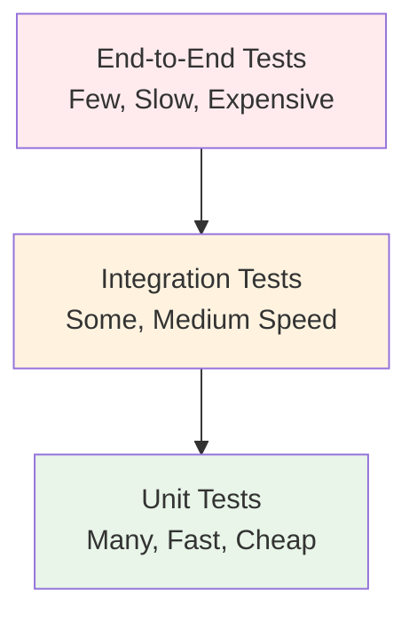

# Testing in Momentum

Testing is a **first-class citizen** in Momentum applications. This comprehensive guide covers testing strategies, patterns, and tools that help you build reliable, maintainable applications with confidence.

> **Prerequisites**: Understanding of [CQRS patterns](./cqrs/) and [Error Handling](./error-handling). New to Momentum? Start with our [Getting Started Guide](./getting-started).

## Testing Philosophy and Strategy

Momentum embraces a **comprehensive testing approach** that balances speed, reliability, and maintainability:

### Testing Pyramid



### Core Principles

| Principle             | Description                                                     | Implementation                         |
| --------------------- | --------------------------------------------------------------- | -------------------------------------- |
| **Test Pyramid**      | Unit tests foundation, integration verification, E2E validation | 70% unit, 20% integration, 10% E2E     |
| **Fail Fast**         | Catch issues early in development cycle                         | Comprehensive validation and CI/CD     |
| **Production Parity** | Tests use real infrastructure                                   | Testcontainers for databases/messaging |
| **Clear Boundaries**  | Separate business logic from infrastructure                     | Mock external dependencies             |
| **Deterministic**     | Tests produce consistent, predictable results                   | Controlled test data and environments  |
| **Independent**       | Tests don't depend on each other                                | Isolated test scenarios                |

### Test Categories by Speed and Scope

| Test Type       | Speed   | Scope                 | Dependencies          | Use Cases                        |
| --------------- | ------- | --------------------- | --------------------- | -------------------------------- |
| **Unit**        | < 1ms   | Single method/class   | Mocks only            | Business logic, validation rules |
| **Integration** | < 1s    | Component interaction | Real DB, messaging    | API endpoints, data access       |
| **Contract**    | < 100ms | Service boundaries    | Mock servers          | API contracts, event schemas     |
| **Performance** | > 1s    | System load           | Production-like setup | Load testing, benchmarks         |

## Testing Types and Strategies

### Unit Tests: Fast Feedback Loop

Unit tests focus on **individual components** in isolation, providing rapid feedback during development.

#### What to Unit Test

| Component            | Focus                   | Example                       |
| -------------------- | ----------------------- | ----------------------------- |
| **Business Logic**   | Core domain rules       | Command handler orchestration |
| **Validation Rules** | Input validation        | FluentValidation rules        |
| **Model Mapping**    | Data transformations    | Entity to DTO conversions     |
| **Calculations**     | Mathematical operations | Pricing, tax calculations     |
| **Result Patterns**  | Success/failure flows   | Result\<T\> pattern handling  |

#### Unit Test Characteristics

```csharp
// ✅ Perfect unit test characteristics
[Test]
[Category("Unit")]  // Fast execution category
public async Task Handle_ValidCommand_ReturnsSuccessWithEvent()
{
    // Arrange (< 10 lines)
    var command = new CreateCashierCommand(
        TenantId: Guid.NewGuid(),
        Name: "John Doe",
        Email: "john@example.com"
    );

    var mockMessaging = new Mock<IMessageBus>();
    mockMessaging
        .Setup(m => m.InvokeCommandAsync(
            It.IsAny<CreateCashierCommandHandler.DbCommand>(),
            It.IsAny<CancellationToken>()))
        .ReturnsAsync(CreateMockEntity(command));

    // Act (1 line)
    var (result, integrationEvent) = await CreateCashierCommandHandler.Handle(
        command, mockMessaging.Object, CancellationToken.None);

    // Assert (clear expectations)
    result.IsSuccess.Should().BeTrue();
    result.Value.Name.Should().Be(command.Name);
    integrationEvent.Should().NotBeNull();
    integrationEvent!.TenantId.Should().Be(command.TenantId);

    // Verify interactions
    mockMessaging.Verify(
        m => m.InvokeCommandAsync(
            It.Is<CreateCashierCommandHandler.DbCommand>(dc =>
                dc.Cashier.Name == command.Name),
            It.IsAny<CancellationToken>()),
        Times.Once);
}  // Total execution: < 5ms
```

### Integration Tests: Real-World Validation

Integration tests verify **complete workflows** using real infrastructure components.

#### What to Integration Test

| Scenario                | Components                            | Validation                       |
| ----------------------- | ------------------------------------- | -------------------------------- |
| **API Endpoints**       | Controller → Handler → Database       | Full HTTP request/response cycle |
| **Event Processing**    | Event publish → Kafka → Event handler | End-to-end messaging flow        |
| **Database Operations** | Handler → DbCommand → Database        | Real transaction behavior        |
| **Authentication**      | JWT validation → Authorization        | Security integration             |
| **External Services**   | HTTP clients → External APIs          | Service integration              |

#### Integration Test Setup

```csharp
// ✅ Comprehensive integration test setup
[TestFixture]
[Category("Integration")]
public class CashierApiIntegrationTests : IAsyncLifetime
{
    private readonly PostgreSqlContainer _dbContainer;
    private readonly KafkaContainer _kafkaContainer;
    private readonly RedisContainer _cacheContainer;
    private WebApplicationFactory<Program> _factory;
    private HttpClient _client;

    public CashierApiIntegrationTests()
    {
        // Testcontainers provide real infrastructure
        _dbContainer = new PostgreSqlBuilder()
            .WithDatabase("test_momentum")
            .WithUsername("test_user")
            .WithPassword("test_password")
            .Build();

        _kafkaContainer = new KafkaBuilder()
            .WithEnvironment("KAFKA_AUTO_CREATE_TOPICS_ENABLE", "true")
            .Build();

        _cacheContainer = new RedisBuilder()
            .Build();
    }

    public async Task InitializeAsync()
    {
        // Start all containers in parallel
        await Task.WhenAll(
            _dbContainer.StartAsync(),
            _kafkaContainer.StartAsync(),
            _cacheContainer.StartAsync());

        // Configure test application
        _factory = new WebApplicationFactory<Program>()
            .WithWebHostBuilder(builder =>
            {
                builder.ConfigureAppConfiguration(config =>
                {
                    config.AddInMemoryCollection(new Dictionary<string, string?>
                    {
                        ["ConnectionStrings:DefaultConnection"] = _dbContainer.GetConnectionString(),
                        ["ConnectionStrings:Messaging"] = _kafkaContainer.GetBootstrapAddress(),
                        ["ConnectionStrings:Cache"] = _cacheContainer.GetConnectionString()
                    });
                });

                builder.UseEnvironment("Testing");
            });

        _client = _factory.CreateClient();

        // Run database migrations
        await RunDatabaseMigrations();
    }

    [Test]
    public async Task CreateCashier_ValidRequest_ReturnsCreatedCashier()
    {
        // Arrange
        var request = new CreateCashierRequest(
            TenantId: Guid.NewGuid(),
            Name: "Integration Test User",
            Email: "integration@test.com"
        );

        // Act
        var response = await _client.PostAsJsonAsync("/api/cashiers", request);

        // Assert HTTP response
        response.StatusCode.Should().Be(HttpStatusCode.Created);

        var cashier = await response.Content.ReadFromJsonAsync<CashierResponse>();
        cashier.Should().NotBeNull();
        cashier!.Name.Should().Be(request.Name);
        cashier.Email.Should().Be(request.Email);

        // Verify database persistence
        using var scope = _factory.Services.CreateScope();
        var db = scope.ServiceProvider.GetRequiredService<AppDomainDb>();

        var persistedCashier = await db.Cashiers
            .FirstOrDefaultAsync(c => c.CashierId == cashier.Id);

        persistedCashier.Should().NotBeNull();
        persistedCashier!.Name.Should().Be(request.Name);

        // Verify event publishing
        await VerifyIntegrationEventPublished<CashierCreated>(
            evt => evt.TenantId == request.TenantId &&
                   evt.Cashier.Id == cashier.Id);
    }

    public async Task DisposeAsync()
    {
        _client?.Dispose();
        await _factory?.DisposeAsync();

        await Task.WhenAll(
            _dbContainer.DisposeAsync().AsTask(),
            _kafkaContainer.DisposeAsync().AsTask(),
            _cacheContainer.DisposeAsync().AsTask());
    }
}
```

## Test Structure

### Project Organization

```
tests/
 AppDomain.Tests/
    Unit/                          # Unit tests
       Cashiers/
          Commands/              # Command handler tests
          Queries/               # Query handler tests
          Validators/            # Validation tests
       Invoices/
       Common/                    # Shared test utilities
    Integration/                   # Integration tests
       Api/                       # API endpoint tests
       Database/                  # Database integration tests
       Events/                    # Event handling tests
       Fixtures/                  # Test infrastructure
    TestUtilities/                 # Common test helpers
```

### Test Naming Conventions

Follow consistent naming patterns that clearly describe what is being tested:

```csharp
// Pattern: MethodName_StateUnderTest_ExpectedBehavior
[Test]
public void Handle_ValidCommand_ReturnsSuccessResult() { }

[Test]
public void Handle_InvalidEmail_ReturnsValidationError() { }

[Test]
public void Validate_EmptyTenantId_ReturnsValidationFailure() { }
```

## Key Testing Patterns

### CQRS Testing

Momentum's CQRS architecture makes testing straightforward:

```csharp
// Command handler testing
[Test]
public async Task CreateCashier_ValidCommand_ReturnsSuccess()
{
    // Arrange - Set up command and mocks
    var command = new CreateCashierCommand(tenantId, "John", "john@example.com");
    var mockMessaging = new Mock<IMessageBus>();

    // Act - Execute handler
    var (result, integrationEvent) = await CreateCashierCommandHandler.Handle(
        command, mockMessaging.Object, CancellationToken.None);

    // Assert - Verify results
    result.IsSuccess.Should().BeTrue();
    integrationEvent.Should().NotBeNull();
}
```

### Result\<T\> Pattern Testing

Test both success and failure scenarios:

```csharp
[Test]
public async Task GetCashier_ExistingCashier_ReturnsSuccess()
{
    var result = await handler.Handle(query);
    result.IsSuccess.Should().BeTrue();
    result.Value.Should().NotBeNull();
}

[Test]
public async Task GetCashier_NonExistentCashier_ReturnsFailure()
{
    var result = await handler.Handle(invalidQuery);
    result.IsSuccess.Should().BeFalse();
    result.Errors.Should().Contain("Cashier not found");
}
```

### Integration Event Testing

Verify that events are properly published and handled:

```csharp
[Test]
public async Task CreateCashier_Success_PublishesIntegrationEvent()
{
    // Create cashier
    var (result, integrationEvent) = await handler.Handle(command);

    // Verify event structure
    integrationEvent.Should().NotBeNull();
    integrationEvent!.TenantId.Should().Be(command.TenantId);
    integrationEvent.Cashier.Name.Should().Be(command.Name);
}
```

## Test Execution and Organization

### Command Line Test Execution

```bash
# Basic test execution
dotnet test                                    # Run all tests
dotnet test --verbosity normal                 # Detailed output
dotnet test --no-build --no-restore          # Skip build for faster execution

# Category-based filtering
dotnet test --filter Category=Unit            # Fast unit tests only
dotnet test --filter Category=Integration     # Integration tests only
dotnet test --filter Category=Performance     # Performance tests only
dotnet test --filter "Category!=Integration"  # Exclude integration tests

# Advanced filtering
dotnet test --filter "FullyQualifiedName~CreateCashierCommandHandlerTests"
dotnet test --filter "TestCategory=Database&Priority=1"
dotnet test --filter "Name~Cashier&Category=Unit"

# Coverage and reporting
dotnet test --collect:"XPlat Code Coverage"                    # Basic coverage
dotnet test --collect:"XPlat Code Coverage" --results-directory ./coverage
dotnet test --collect:"XPlat Code Coverage" --settings coverlet.runsettings

# Parallel execution
dotnet test --parallel                        # Run tests in parallel
dotnet test --parallel --max-cpu-count:4      # Limit parallel execution

# CI/CD optimized execution
dotnet test --configuration Release --no-build --verbosity minimal --collect:"XPlat Code Coverage" --results-directory ./TestResults --logger trx
```

### Test Organization and Categorization

Organize tests with **descriptive categories** and attributes for efficient execution:

```csharp
// ✅ Comprehensive test categorization
[TestFixture]
[Category("Unit")]          // Primary category
[TestFixture("Cashiers")]   // Domain area
public class CreateCashierCommandHandlerTests
{
    [Test]
    [Category("Validation")]    // Sub-category
    [Priority(1)]              // Execution priority
    [Timeout(5000)]            // 5-second timeout
    public async Task Handle_InvalidEmail_ReturnsValidationError()
    {
        // Test implementation
    }

    [Test]
    [Category("BusinessLogic")]
    [TestCase("john@example.com", ExpectedResult = true)]
    [TestCase("invalid-email", ExpectedResult = false)]
    public bool EmailValidation_TestCases(string email)
    {
        return EmailValidator.IsValid(email);
    }
}

[TestFixture]
[Category("Integration")]
[Category("Database")]
public class DatabaseIntegrationTests
{
    [Test]
    [Category("Smoke")]         // Critical path tests
    public async Task DatabaseConnection_CanConnect()
    {
        // Essential connectivity test
    }

    [Test]
    [Category("Performance")]
    [Explicit]                  // Only run when explicitly requested
    public async Task LargeDataSet_ProcessingTime()
    {
        // Performance-sensitive test
    }
}

// Custom attributes for better organization
[AttributeUsage(AttributeTargets.Method)]
public class IntegrationTestAttribute : Attribute
{
    public string TestType { get; set; } = "Integration";
    public bool RequiresDatabase { get; set; } = true;
    public bool RequiresMessaging { get; set; } = false;
}

// Usage
[Test]
[IntegrationTest(TestType = "API", RequiresDatabase = true, RequiresMessaging = true)]
public async Task FullWorkflow_CreateCashierAndPublishEvent()
{
    // Comprehensive integration test
}
```

### Continuous Integration

Configure CI pipelines to run different test suites:

```yaml
# Fast feedback - run unit tests on every commit
- name: Unit Tests
  run: dotnet test --filter Category=Unit --no-restore

# Full verification - run all tests on PR/main branch
- name: Integration Tests
  run: dotnet test --filter Category=Integration --verbosity normal
```

## Test Infrastructure

### Testcontainers Integration

Momentum uses Testcontainers for reliable integration testing:

```csharp
public class IntegrationTestFixture : IAsyncLifetime
{
    private readonly PostgreSqlContainer _dbContainer;
    private readonly KafkaContainer _kafkaContainer;

    public async Task InitializeAsync()
    {
        await _dbContainer.StartAsync();
        await _kafkaContainer.StartAsync();
        // Configure application with container connection strings
    }
}
```

### Test Data Management

Use builders and factories for consistent test data creation:

```csharp
public class CashierTestDataBuilder
{
    public CashierTestDataBuilder WithName(string name) { /* ... */ }
    public CashierTestDataBuilder WithEmail(string email) { /* ... */ }
    public Cashier Build() { /* ... */ }
}

// Usage
var cashier = new CashierTestDataBuilder()
    .WithName("Test User")
    .WithEmail("test@example.com")
    .Build();
```

## Testing Best Practices

### Unit Testing Excellence

#### ✅ Focus on Business Logic

```csharp
// ✅ Good: Test business logic with mocks
[Test]
public async Task Handle_DuplicateEmail_ReturnsValidationError()
{
    // Arrange - Focus on the business scenario
    var command = new CreateCashierCommand(
        Guid.NewGuid(), "John Doe", "existing@example.com");

    var mockMessaging = new Mock<IMessageBus>();

    // Mock the database response to simulate duplicate
    mockMessaging
        .Setup(m => m.InvokeCommandAsync(
            It.IsAny<CreateCashierCommandHandler.DbCommand>(),
            It.IsAny<CancellationToken>()))
        .ThrowsAsync(new PostgresException("duplicate key", "23505"));

    // Act - Test the business logic
    var (result, integrationEvent) = await CreateCashierCommandHandler.Handle(
        command, mockMessaging.Object, CancellationToken.None);

    // Assert - Verify business outcome
    result.IsSuccess.Should().BeFalse();
    result.Errors.Should().ContainSingle("Email address already exists");
    integrationEvent.Should().BeNull(); // No event on failure
}

// ❌ Bad: Testing infrastructure instead of business logic
[Test]
public async Task DatabaseConnection_CanConnect()  // This is infrastructure, not business logic
{
    using var connection = new NpgsqlConnection(connectionString);
    await connection.OpenAsync();
    connection.State.Should().Be(ConnectionState.Open);
}
```

#### ✅ Strategic Mocking

```csharp
// ✅ Good: Mock external dependencies, keep internal logic real
public class CreateCashierCommandHandlerTests
{
    private readonly Mock<IMessageBus> _mockMessaging;
    private readonly Mock<IEmailService> _mockEmailService;
    private readonly Mock<ILogger<CreateCashierCommandHandler>> _mockLogger;

    [Test]
    public async Task Handle_ValidCommand_CallsEmailService()
    {
        // Arrange
        var command = new CreateCashierCommand(
            Guid.NewGuid(), "John Doe", "john@example.com");

        var expectedEntity = CreateMockCashierEntity(command);

        _mockMessaging
            .Setup(m => m.InvokeCommandAsync(It.IsAny<DbCommand>(), It.IsAny<CancellationToken>()))
            .ReturnsAsync(expectedEntity);

        // Act
        var (result, integrationEvent) = await CreateCashierCommandHandler.Handle(
            command, _mockMessaging.Object, _mockEmailService.Object, _mockLogger.Object, CancellationToken.None);

        // Assert - Verify the business logic called external services correctly
        result.IsSuccess.Should().BeTrue();

        _mockEmailService.Verify(
            e => e.SendWelcomeEmailAsync(
                command.Email,
                command.Name,
                It.IsAny<CancellationToken>()),
            Times.Once);
    }
}

// ❌ Bad: Over-mocking internal logic
[Test]
public void CreateInsertCommand_MockEverything()  // Don't mock pure functions
{
    var mockCommandFactory = new Mock<ICommandFactory>();  // ❌ Unnecessary mock
    mockCommandFactory.Setup(f => f.CreateInsertCommand(It.IsAny<CreateCashierCommand>()))
                     .Returns(new DbCommand(...));  // ❌ Mocking simple logic

    // This test doesn't verify real behavior
}
```

#### ✅ Comprehensive Error Testing

```csharp
// ✅ Good: Test both success and failure scenarios
[TestFixture]
public class GetCashierQueryHandlerTests
{
    [Test]
    public async Task Handle_ExistingCashier_ReturnsSuccess()
    {
        // Test success path
        var query = new GetCashierQuery(TenantId, CashierId);
        var mockDb = CreateMockDb(withCashier: true);

        var result = await GetCashierQueryHandler.Handle(query, mockDb, CancellationToken.None);

        result.IsSuccess.Should().BeTrue();
        result.Value.Should().NotBeNull();
    }

    [Test]
    public async Task Handle_NonExistentCashier_ReturnsNotFound()
    {
        // Test failure path
        var query = new GetCashierQuery(TenantId, CashierId);
        var mockDb = CreateMockDb(withCashier: false);

        var result = await GetCashierQueryHandler.Handle(query, mockDb, CancellationToken.None);

        result.IsSuccess.Should().BeFalse();
        result.Errors.Should().ContainSingle("Cashier not found");
    }

    [Test]
    public async Task Handle_DatabaseException_ThrowsException()
    {
        // Test exceptional circumstances
        var query = new GetCashierQuery(TenantId, CashierId);
        var mockDb = CreateMockDb(throwException: true);

        await Assert.ThrowsAsync<DatabaseException>(
            () => GetCashierQueryHandler.Handle(query, mockDb, CancellationToken.None));
    }

    [Test]
    public async Task Handle_CancellationRequested_ThrowsOperationCancelledException()
    {
        // Test cancellation handling
        var query = new GetCashierQuery(TenantId, CashierId);
        var mockDb = CreateMockDb(withDelay: TimeSpan.FromSeconds(5));

        using var cts = new CancellationTokenSource(TimeSpan.FromMilliseconds(100));

        await Assert.ThrowsAsync<OperationCanceledException>(
            () => GetCashierQueryHandler.Handle(query, mockDb, cts.Token));
    }
}
```

### Integration Testing Excellence

#### ✅ Realistic Test Scenarios

```csharp
// ✅ Good: Test complete user workflows
[Test]
public async Task CompleteWorkflow_CreateCashierProcessInvoiceAndPay()
{
    // Arrange - Setup realistic scenario
    var tenantId = Guid.NewGuid();

    // Act & Assert - Step through realistic workflow

    // Step 1: Create cashier
    var createCashierRequest = new CreateCashierRequest(
        tenantId, "John Doe", "john@example.com");

    var createResponse = await _client.PostAsJsonAsync("/api/cashiers", createCashierRequest);
    createResponse.StatusCode.Should().Be(HttpStatusCode.Created);

    var cashier = await createResponse.Content.ReadFromJsonAsync<CashierResponse>();

    // Step 2: Create invoice for cashier
    var createInvoiceRequest = new CreateInvoiceRequest(
        tenantId, cashier.Id, 100.00m, "Test Invoice");

    var invoiceResponse = await _client.PostAsJsonAsync("/api/invoices", createInvoiceRequest);
    invoiceResponse.StatusCode.Should().Be(HttpStatusCode.Created);

    var invoice = await invoiceResponse.Content.ReadFromJsonAsync<InvoiceResponse>();

    // Step 3: Process payment
    var processPaymentRequest = new ProcessPaymentRequest(
        tenantId, invoice.Id, 100.00m, "4111111111111111");

    var paymentResponse = await _client.PostAsJsonAsync(
        $"/api/invoices/{invoice.Id}/payment", processPaymentRequest);
    paymentResponse.StatusCode.Should().Be(HttpStatusCode.OK);

    // Step 4: Verify final state
    var finalInvoiceResponse = await _client.GetAsync($"/api/invoices/{invoice.Id}");
    var finalInvoice = await finalInvoiceResponse.Content.ReadFromJsonAsync<InvoiceResponse>();

    finalInvoice.Status.Should().Be(InvoiceStatus.Paid);

    // Step 5: Verify events were published
    await VerifyEventsPublished(
        new CashierCreated(tenantId, cashier),
        new InvoiceCreated(tenantId, invoice),
        new InvoicePaymentProcessed(tenantId, invoice.Id));
}
```

#### ✅ Data Isolation and Cleanup

```csharp
// ✅ Good: Each test manages its own data
[TestFixture]
public class CashierIntegrationTests : IntegrationTestBase
{
    [Test]
    public async Task CreateCashier_UniqueEmailPerTest()
    {
        // Arrange - Use unique identifiers
        var tenantId = Guid.NewGuid();  // Unique tenant per test
        var uniqueEmail = $"test-{Guid.NewGuid()}@example.com";  // Unique email

        var request = new CreateCashierRequest(tenantId, "Test User", uniqueEmail);

        // Act
        var response = await _client.PostAsJsonAsync("/api/cashiers", request);

        // Assert
        response.StatusCode.Should().Be(HttpStatusCode.Created);

        // Cleanup happens automatically via unique IDs
        // No explicit cleanup needed
    }

    [Test]
    public async Task CreateCashier_ExplicitCleanup_WhenNeeded()
    {
        var tenantId = Guid.NewGuid();
        var cashierId = Guid.Empty;

        try
        {
            // Arrange & Act
            var request = new CreateCashierRequest(tenantId, "Cleanup Test", "cleanup@example.com");
            var response = await _client.PostAsJsonAsync("/api/cashiers", request);
            var cashier = await response.Content.ReadFromJsonAsync<CashierResponse>();
            cashierId = cashier.Id;

            // Assert
            response.StatusCode.Should().Be(HttpStatusCode.Created);
        }
        finally
        {
            // Explicit cleanup when needed
            if (cashierId != Guid.Empty)
            {
                await CleanupCashier(tenantId, cashierId);
            }
        }
    }
}
```

## Specialized Testing Guides

For comprehensive coverage of specific testing topics, explore these detailed guides:

### Core Testing Approaches

1. **Unit Testing** - Deep dive into unit testing patterns, mocking strategies, and testing individual components
2. **Integration Testing** - Complete guide to end-to-end testing with Testcontainers and real infrastructure
3. **Contract Testing** - API contract verification and consumer-driven contract testing

### Specialized Testing

4. **Performance Testing** - Load testing, benchmarking, and performance validation
5. **Event Testing** - Testing integration events and messaging workflows
6. **Security Testing** - Authentication, authorization, and security validation

### Advanced Topics

7. **Test Data Management** - Strategies for creating, managing, and cleaning up test data
8. **Mocking Strategies** - Advanced mocking patterns and best practices
9. **CI/CD Testing** - Continuous integration and deployment testing strategies

## Testing Tools and Infrastructure

### Essential Testing Libraries

```xml
<!-- Core testing frameworks -->
<PackageReference Include="NUnit" Version="3.14.0" />
<PackageReference Include="FluentAssertions" Version="6.12.0" />
<PackageReference Include="Moq" Version="4.20.69" />

<!-- Integration testing -->
<PackageReference Include="Microsoft.AspNetCore.Mvc.Testing" Version="8.0.0" />
<PackageReference Include="Testcontainers" Version="3.6.0" />
<PackageReference Include="Testcontainers.PostgreSql" Version="3.6.0" />
<PackageReference Include="Testcontainers.Kafka" Version="3.6.0" />
<PackageReference Include="Testcontainers.Redis" Version="3.6.0" />

<!-- Performance testing -->
<PackageReference Include="NBomber" Version="5.0.0" />
<PackageReference Include="BenchmarkDotNet" Version="0.13.12" />

<!-- Code coverage -->
<PackageReference Include="coverlet.collector" Version="6.0.0" />
<PackageReference Include="coverlet.msbuild" Version="6.0.0" />
```

### Test Infrastructure Configuration

```csharp
// Base test class with common setup
public abstract class TestBase
{
    protected IServiceProvider Services { get; private set; }
    protected IConfiguration Configuration { get; private set; }

    [SetUp]
    public virtual void Setup()
    {
        var services = new ServiceCollection();
        var config = new ConfigurationBuilder()
            .AddInMemoryCollection(GetTestConfiguration())
            .Build();

        Configuration = config;
        services.AddSingleton(config);

        ConfigureServices(services);
        Services = services.BuildServiceProvider();
    }

    protected virtual void ConfigureServices(IServiceCollection services)
    {
        // Override in derived classes
    }

    protected virtual Dictionary<string, string?> GetTestConfiguration()
    {
        return new Dictionary<string, string?>
        {
            ["Environment"] = "Testing",
            ["Logging:LogLevel:Default"] = "Warning",
            ["ConnectionStrings:DefaultConnection"] = "InMemory"
        };
    }

    [TearDown]
    public virtual void TearDown()
    {
        (Services as IDisposable)?.Dispose();
    }
}
```

## Common Testing Challenges and Solutions

### Time-Dependent Tests

```csharp
// ✅ Good: Use controllable time
public interface IDateTimeProvider
{
    DateTime UtcNow { get; }
}

[Test]
public async Task Handle_CreatesEntityWithCorrectTimestamp()
{
    // Arrange
    var fixedTime = new DateTime(2024, 1, 15, 10, 30, 0, DateTimeKind.Utc);
    var mockTimeProvider = new Mock<IDateTimeProvider>();
    mockTimeProvider.Setup(x => x.UtcNow).Returns(fixedTime);

    // Act
    var result = await handler.Handle(command, mockTimeProvider.Object);

    // Assert
    result.Value.CreatedDate.Should().Be(fixedTime);
}

// ❌ Bad: Unpredictable time-based assertions
[Test]
public async Task Handle_CreatesEntityWithRecentTimestamp()
{
    var before = DateTime.UtcNow;
    var result = await handler.Handle(command);
    var after = DateTime.UtcNow;

    // ❌ Flaky test - timing issues
    result.Value.CreatedDate.Should().BeAfter(before);
    result.Value.CreatedDate.Should().BeBefore(after);
}
```

### Asynchronous Testing

```csharp
// ✅ Good: Proper async test patterns
[Test]
public async Task Handle_AsyncOperation_CompletesSuccessfully()
{
    // Arrange
    var command = new AsyncCommand();

    // Act - Use proper async/await
    var result = await handler.HandleAsync(command, CancellationToken.None);

    // Assert
    result.IsSuccess.Should().BeTrue();
}

// ✅ Good: Test cancellation handling
[Test]
public async Task Handle_CancellationRequested_ThrowsOperationCancelledException()
{
    var command = new LongRunningCommand();
    using var cts = new CancellationTokenSource(TimeSpan.FromMilliseconds(100));

    await Assert.ThrowsAsync<OperationCanceledException>(
        () => handler.HandleAsync(command, cts.Token));
}

// ❌ Bad: Blocking async operations
[Test]
public void Handle_AsyncOperation_BlockingCall()
{
    var command = new AsyncCommand();

    // ❌ Bad - blocking async call
    var result = handler.HandleAsync(command, CancellationToken.None).Result;

    result.IsSuccess.Should().BeTrue();
}
```

## Troubleshooting and Next Steps

### Common Issues

For detailed troubleshooting of testing issues, see the [Troubleshooting Guide](./troubleshooting#testing-issues).

### Next Steps

Now that you understand testing fundamentals, explore these areas:

#### Testing Techniques

1. **Unit Testing** - Master component-level testing patterns
2. **Integration Testing** - End-to-end verification strategies
3. **Performance Testing** - Load testing and benchmarking

#### Domain-Specific Testing

4. **[CQRS Testing](./cqrs/#testing-commands-and-queries)** - Commands, queries, and handlers
5. **[Database Testing](./database/dbcommand#testing-dbcommand-patterns)** - Data access and DbCommand patterns
6. **[Event Testing](./messaging/#testing-events)** - Integration events and messaging

#### Advanced Topics

7. **[Best Practices](./best-practices#testing-guidelines)** - Production testing strategies
8. **[CI/CD Integration](./best-practices#continuous-integration)** - Automated testing pipelines
9. **[Monitoring and Observability](./service-configuration/observability#testing-observability)** - Testing observability features
